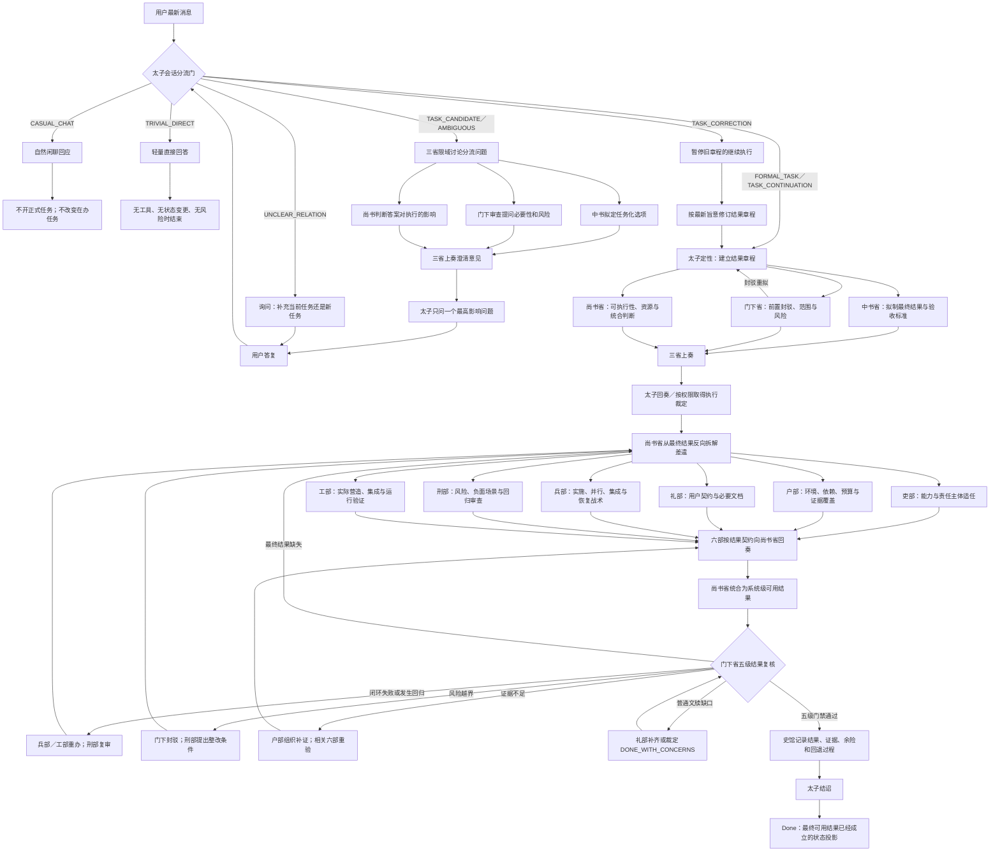
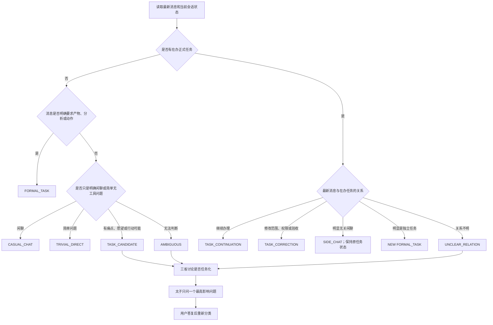
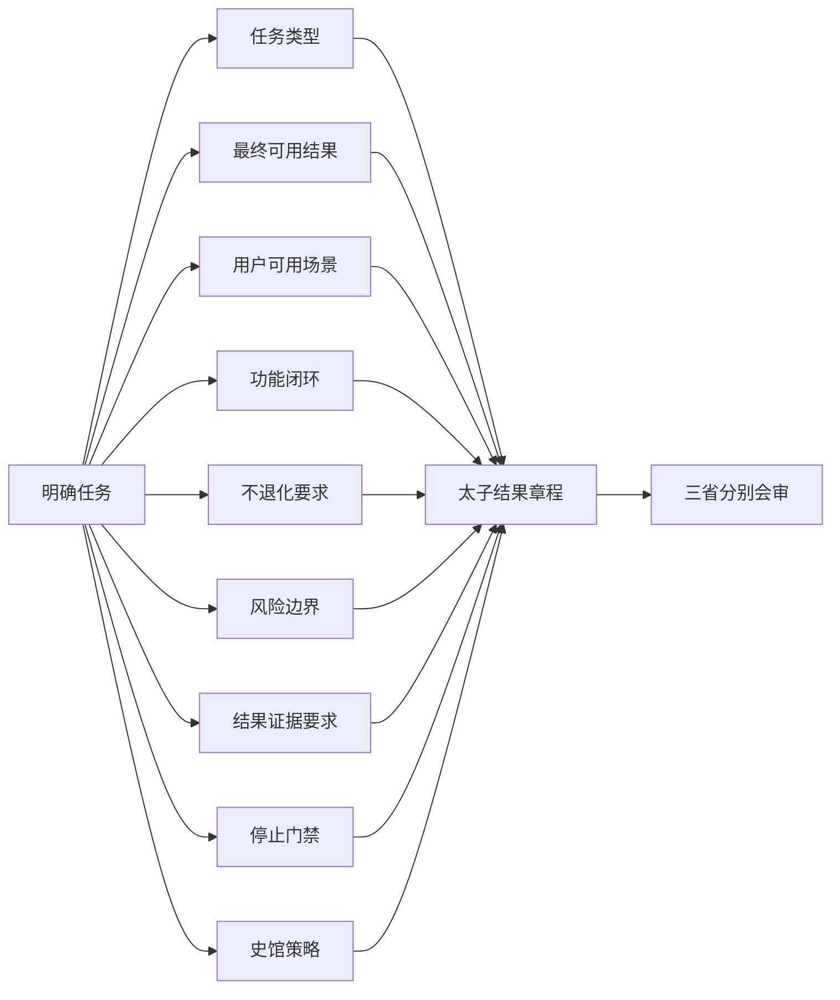
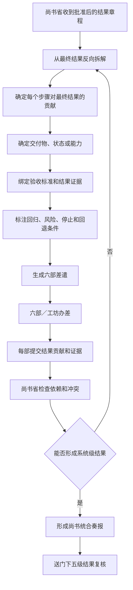
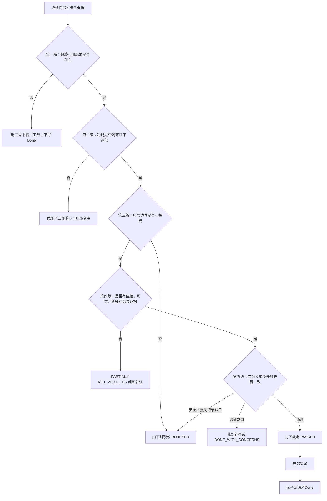
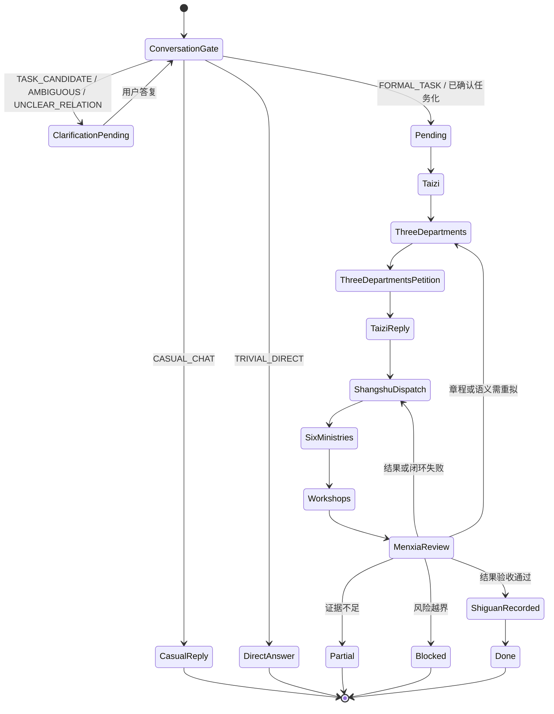
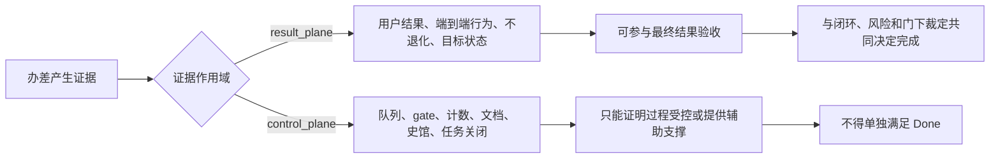
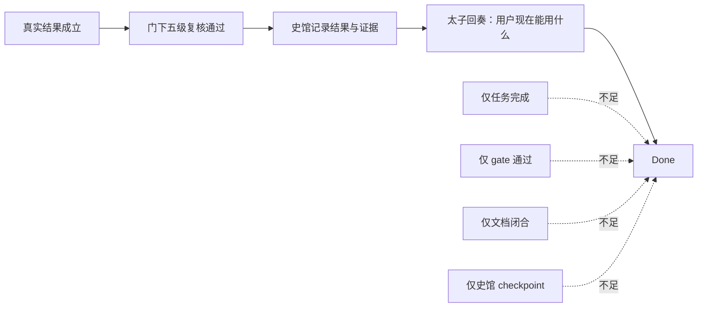

# 三省六部 Skill 拟整改后最新工作流程图

- 日期：2026-07-12
- 对照基线：`release/beta0.5.9`，commit `040f707`
- 状态：目标设计，尚未实施
- 对照文件：`三省六部Skill_现行整改前工作流程图_2026-07-12.md`
- 方案文件：`三省六部Skill_结果导向与会话分流整体整改方案_2026-07-12.md`

## 1. 拟整改后的完整主流程



## 2. 太子会话分流子流程



### 会话分流的关键规则

- 闲聊不自动开朝，也不自动取消或完成已有任务。
- 明确任务不因语气随意而被降格为闲聊。
- 只有痛点或设想、但没有明确请求动作时，先取得任务化同意。
- 拿不准时不猜测，只问一个能决定路由的关键问题。
- 能由本地上下文或低成本只读检查确定的事实，不转问用户。
- 用户修改范围、权限、非目标或验收标准时，按 `TASK_CORRECTION` 更新章程并返回三省复议。

## 3. 结果章程形成流程



结果章程不以“完成多少任务”为核心，而以“任务结束后用户真正获得什么”为核心。

## 4. 六部结果契约流程



六部任务全部关闭只代表分项流程结束；只有尚书省成功统合并通过门下复核，才代表系统级结果成立。

## 5. 门下省五级结果复核子流程



### 门下裁定顺序

```text
最终可用结果
> 功能闭环且不退化
> 风险边界
> 可验证证据
> 文档与单项任务完成
```

这里的优先级表示：低层证据不能替代高层事实。风险门仍是全程硬约束，不意味着可以先越过风险完成实现。

## 6. 拟整改后的状态语义

正式运行时主链保持：



说明：

- `ConversationGate` 是正式任务创建前的逻辑门，不一定需要成为持久化运行时状态。
- `CASUAL_CHAT`、`TRIVIAL_DIRECT` 不创建正式 court task。
- `TASK_CORRECTION` 更新结果章程后必须回到三省会审。
- `Partial`、`Blocked` 可以采用独立状态或结构化 closeout status，最终实现时需要结合兼容性设计决定；无论采用哪种存储方式，都不得被映射成 `Done`。
- `Done` 必须经结构化完成命令产生，不能由自由文本 evidence 直接进入。

## 7. 结果证据与控制面证据



## 8. 拟整改后的结诏关系



## 9. 与整改前流程图的对照点

| 对照项 | 整改前 | 拟整改后 |
| --- | --- | --- |
| 会话入口 | 太子分类原则分散在规范文本中 | 独立会话分流门和结构化分类 |
| 闲聊 | 可跳过正式流程，但边界不够集中 | `CASUAL_CHAT`，不开任务且不改变在办任务 |
| 可任务化意图 | 归入一般非明确任务澄清 | `TASK_CANDIDATE`，先询问是否正式任务化 |
| 在办任务关系 | 主要依赖自然语言理解 | 明确续办、修正、旁支闲聊、新任务和关系不明 |
| 澄清 | 每轮一个问题 | 保留一问一审，并优先解决任务化和任务归属 |
| 太子定性 | 语义章程 | 加强为以最终可用结果为核心的结果章程 |
| 尚书分派 | 按职责和依赖派遣六部 | 从最终结果反向拆解，每份差遣绑定结果贡献 |
| 门下复核 | 完整性、风险、证据和漂移复核 | 固定五级结果优先顺序及失败回退路径 |
| Done | 文档要求严格，但运行时只要求非空 evidence | 结构化结果门通过后才能原子化完成 |
| 史馆 | 记录正式过程和证据 | 明确后置记录已成立结果，不能反向制造完成 |

## 10. 本文件状态

本图展示拟整改后的最新目标流程，不代表当前 skill 或运行时已经具备这些状态、字段和门禁。生成本文件时未修改 `SKILL.md`、governing references、运行时代码、测试、活动安装副本或史馆数据。
