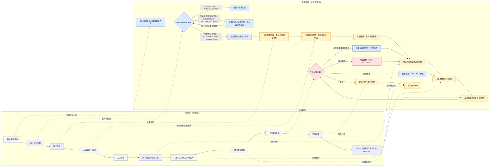
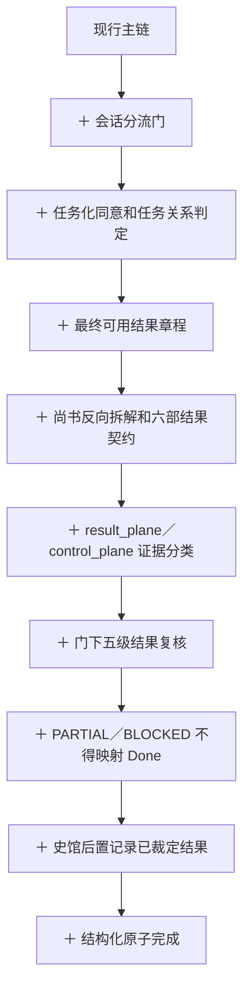
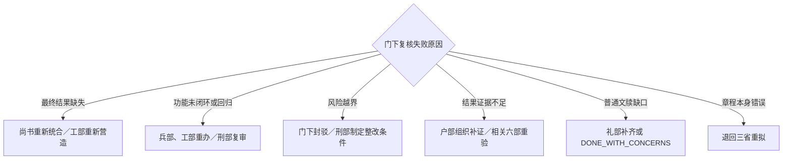

# 三省六部 Skill 整改前后差异分析与差异流程图

- 日期：2026-07-12
- 对照基线：`release/beta0.5.9`，commit `040f707`
- 整改前依据：`三省六部Skill_现行整改前工作流程图_2026-07-12.md`
- 拟整改依据：`三省六部Skill_拟整改后最新工作流程图_2026-07-12.md`
- 状态：差异分析和目标设计，尚未实施

## 1. 总体结论

整改前后保持同一条三省六部主链：

```text
太子定性
-> 三省会审
-> 三省上奏
-> 太子回奏
-> 尚书统六部
-> 工坊办差
-> 门下复核
-> 史馆实录
```

变化不在于另建官署或改写上下级，而在四个位置增加或强化判定：

1. **入口**：把分散的闲聊／任务判断提升为结构化会话分流门。
2. **定性**：把普通语义章程强化为“最终可用结果”驱动的结果章程。
3. **执行**：把按任务分工强化为从最终结果反向拆解的六部结果契约。
4. **结案**：把一般完整性复核强化为五级结果门，并收紧 `Done`。

## 2. 差异类型概览

### 2.1 新增能力

1. `conversation_gate`：正式任务创建前的结构化会话分流。
2. `TASK_CANDIDATE` 与任务化同意：用户表达痛点或设想时，不擅自转成任务。
3. 在办任务关系分类：续办、修正、旁支闲聊、新任务和关系不明。
4. `result_plane` / `control_plane`：结果证据与控制面证据分离。

### 2.2 强化能力

1. 太子语义章程强化为结果章程。
2. 中书省验收标准强化为用户结果与阻断性标准。
3. 尚书省分派强化为从最终结果反向拆解。
4. 六部回奏强化为结果贡献、交付物和证据契约。
5. 门下省复核强化为五级结果优先门禁及明确回退路径。
6. 史馆强化为后置记录已成立结果，不得反向制造完成。

### 2.3 保持不变

1. 最新用户旨意优先。
2. 太子是唯一用户侧路由、转奏和综合回奏者。
3. 中书省、门下省、尚书省保持平级三省。
4. 中书省和门下省不得直接指挥六部。
5. 尚书省仍是正常情况下唯一统辖六部并整合回奏的官署。
6. 门下省仍保留封驳和最终复核权。
7. 史馆仍是三省共监、门下主审，不是第七部。
8. `super并行` 与 `superCC` 的运行时语义不改变。
9. 澄清继续实行“一轮一问、一问一审”。
10. 三权、安全、破坏性操作、隐私、付费和外部状态边界不放宽。

## 3. 逐节点差异

| 流程位置 | 整改前 | 拟整改后 | 变化类型 | 直接效果 |
| --- | --- | --- | --- | --- |
| 用户入口 | 太子依据文本原则初步分类 | `conversation_gate` 同时读取消息和当前会话状态 | 新增 | 分流可审计、可测试 |
| 闲聊 | 明确闲聊可直接回答 | `CASUAL_CHAT`；不开任务且不改变在办任务 | 强化 | 防止闲聊误开任务或误改旨 |
| 轻量问题 | 可作为 trivial no-tool intake 直接回答 | `TRIVIAL_DIRECT` 严格限定无工具、无状态变更、无风险 | 强化 | 避免复杂任务绕过三省 |
| 可任务化表达 | 归入一般非明确任务 | `TASK_CANDIDATE`；先取得任务化同意 | 新增 | 不把感慨、痛点、设想擅自变成执行任务 |
| 意图不明 | 进入澄清循环 | `AMBIGUOUS`；三省先审，只问一个决定路由的问题 | 强化 | 澄清优先解决是否任务化 |
| 在办任务续办 | 主要依赖自然语言理解 | `TASK_CONTINUATION` | 新增 | 明确继承当前结果章程 |
| 在办任务修正 | 最新旨意覆盖旧旨意 | `TASK_CORRECTION`；暂停旧章程继续执行并回三省复议 | 强化 | 防止旧计划继续越旨执行 |
| 在办任务旁支闲聊 | 无统一结构字段 | `SIDE_CHAT`；任务状态保持不变 | 新增 | 不把插话误认为取消、完成或改旨 |
| 新旧任务关系 | 主要由太子临时判断 | `UNCLEAR_RELATION`；询问补充当前还是另开任务 | 新增 | 防止两个任务边界混合 |
| 太子定性 | 建立完整语义章程 | 结果章程首先定义用户最终能使用什么 | 强化 | 从任务导向转为结果导向 |
| 中书拟旨 | 意图、拆解、验收标准 | 绑定最终结果、可用场景和阻断性标准 | 强化 | 子任务标准不得脱离用户结果 |
| 门下前审 | 风险、范围、必要性、漂移 | 额外识别 gate、文档、计数冒充结果的假完成路径 | 强化 | 提前阻断伪完成设计 |
| 尚书会审 | 资源、分派和统合可行性 | 从最终结果反向设计依赖、六部贡献和回退路径 | 强化 | 防止只追求任务清单完成 |
| 六部差遣 | 按职责与依赖派遣 | 每份差遣绑定结果贡献、交付物、证据、回归和停止条件 | 强化 | 六部输出能够被系统级统合 |
| 尚书整合 | 汇总六部回奏 | 明确判断是否形成系统级可用结果 | 强化 | 六部全部完成不再等于任务完成 |
| 门下复核 | 完整性、风险、证据和语义漂移复核 | 固定五级顺序：结果、闭环不退化、风险、证据、文牍 | 强化 | 低层材料不能替代高层事实 |
| 失败回退 | 可退回三省或尚书省，粒度较粗 | 按失败层返回尚书／工部、兵部／工部／刑部、户部或礼部 | 强化 | 重办责任和路径清晰 |
| 证据 | 各类证据并列呈现 | 区分 `result_plane` 与 `control_plane` | 新增 | gate、计数、文档不能单独满足完成 |
| `Done` | 文档要求较严；运行时只强制 evidence 非空 | 结构化结果门通过后才能原子化完成 | 行为收紧 | 消除泛化自由文本证据完成路径 |
| `PARTIAL/BLOCKED` | 多见于报告状态，运行时主状态表达有限 | 明确不得映射成 `Done` | 强化 | 真实区分完成、部分和受阻 |
| 史馆 | 记录过程和证据链 | 只记录门下已经接受或明确拒绝的结果 | 强化 | checkpoint 不再被误认为结果本身 |

## 4. 整改前后差异流程图

图例：灰色表示保持的主链，蓝色表示新增，黄色表示强化，红色表示新增阻断门。



## 5. 仅看“新增节点”的差异链



## 6. 失败回退差异

### 整改前

```text
门下复核失败
-> 退回尚书重办，或退回三省重拟，或 Rejected/Cancelled
```

### 拟整改后



差异在于整改后不只知道“失败了”，还知道是哪一层失败、由哪个官署负责，以及能否继续声称完成。

## 7. 状态与兼容性差异

| 项目 | 整改前行为 | 拟整改行为 | 兼容风险 |
| --- | --- | --- | --- |
| 正式任务创建 | 可直接创建 `Pending` | 先通过逻辑 `conversation_gate` | 中 |
| `Taizi -> Done` 快捷路径 | 合法且只要求非空 evidence | 只允许符合任务类型的结构化结果完成 | 高 |
| `TaiziReply -> Done` 快捷路径 | 合法且只要求非空 evidence | 必须通过结果契约；实现类任务不得绕过执行链 | 高 |
| `ShiguanRecorded -> Done` | 非空 evidence 即可 | 必须已有门下结构化结果裁定 | 高 |
| 旧任务账本 | schema v2，自由文本证据 | 迁移为 `UNASSESSED`，不得自动推断通过 | 高 |
| 澄清任务 | 可能已进入正式任务语义 | 可使用前置逻辑状态，不必污染正式任务账本 | 中 |
| `PARTIAL/BLOCKED` | 主要在报告层表达 | 需要独立状态或结构化 closeout status | 中 |
| response fixtures | 强调十四行格式和字段 | 还要证明结果、闭环、不退化和证据层级 | 中 |

## 8. 最关键的行为差异

### 整改前可以出现

```text
任务、gate、验证脚本和文档均显示通过
-> evidence 非空
-> Done
```

### 拟整改后必须满足

```text
最终可用结果成立
AND 功能闭环且不退化
AND 风险边界可接受
AND 存在直接结果证据
AND 门下五级复核通过
AND 史馆完成允许范围内的记录
-> 原子化 Done
```

控制面全部通过但最终结果缺失时，只能得到：

```text
PARTIAL / NOT_VERIFIED / BLOCKED / RETURN_FOR_REWORK
```

不能得到 `Done`。

## 9. 变更边界

差异方案不改变：

- 三省六部历史职责和上下级关系。
- 太子、三省、尚书省、六部、门下省和史馆的主体身份。
- `super并行` 与 `superCC` 的运行时分支。
- 三权、安全和外部状态门禁。
- 用户侧十四行结诏标签数量。

差异方案将改变：

- 正式任务创建前的会话分流方式。
- 太子章程、六部差遣和门下验收的数据契约。
- `Done` 的运行时门禁和旧任务兼容策略。
- 发布门禁必须覆盖的假完成反例。

## 10. 本文件状态

本文件仅对比现行流程与拟整改流程，并生成差异图。它不代表上述差异已经写入 `SKILL.md`、governing references、运行时代码、测试、发布门禁、活动安装副本或史馆。
