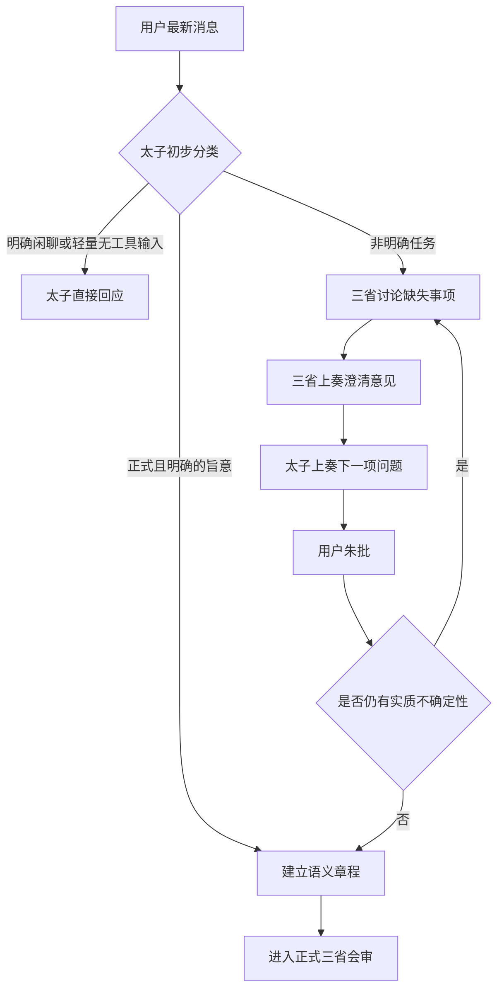
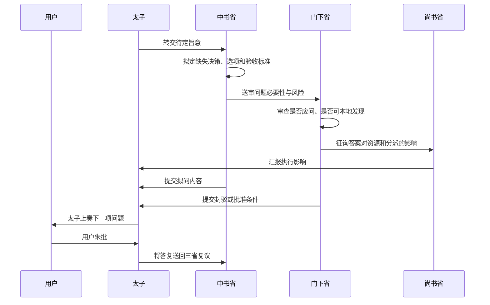
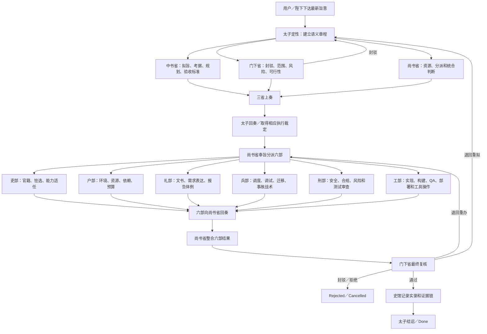
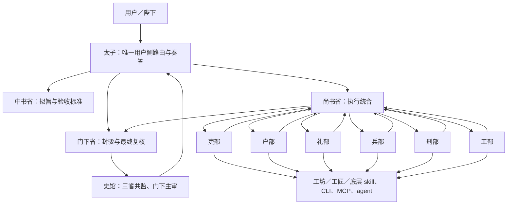
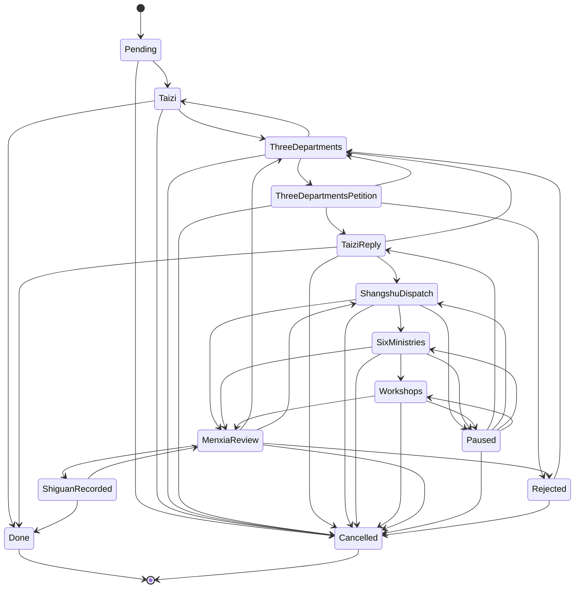
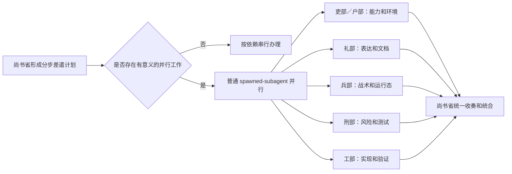

# 三省六部 Skill 现行（整改前）工作流程图

- 日期：2026-07-12
- 基线：`release/beta0.5.9`，commit `040f707`
- 状态：现状图，仅用于审阅
- 说明：本文件按当前 `SKILL.md`、governing references 和 `scripts/court_runtime.py` 绘制，不包含拟整改后的新门禁

## 1. 当前入口语义

现有核心契约已经提到：太子应先分类消息、区分闲聊与正式旨意，并对不明确任务进入澄清循环。但这一入口判断目前主要是文本规范，没有作为独立、结构化、机器可检查的会话门禁。



### 当前澄清循环



当前规则要求每轮只问一个实质问题；如果用户答复产生新不确定性，需要重新进行三省讨论，不能直接追加未经会审的问题。

## 2. 当前正式语义流程

当前文档规定的正式主链为：

```text
太子定性
-> 三省会审
-> 三省上奏
-> 太子回奏
-> 尚书统六部
-> 工坊办差
-> 门下复核
-> 史馆实录
```

对应流程图：



## 3. 当前官署上下级关系



语义约束：

- 中书省、门下省、尚书省是平级三省。
- 中书省和门下省不得直接指挥六部。
- 尚书省是正常情况下唯一统辖六部并整合回奏的官署。
- 六部向尚书省报告，不直接对用户奏答。
- 史馆不是尚书省下辖的第七部，而是三省共监、门下主审的记录机构。
- 太子负责接旨、转奏、综合和最终奏答，不得代替三省、六部或史馆履职。

## 4. 当前机器状态机

当前 `scripts/court_runtime.py` 的主状态和合法转换如下：



### 状态名称与语义

| 状态 | 当前含义 |
| --- | --- |
| `Pending` | 任务已创建，尚未进入太子定性 |
| `Taizi` | 太子整理旨意和语义章程 |
| `ThreeDepartments` | 三省会审 |
| `ThreeDepartmentsPetition` | 三省形成上奏 |
| `TaiziReply` | 太子综合回奏并承接相应裁定 |
| `ShangshuDispatch` | 尚书省制定并执行分派 |
| `SixMinistries` | 六部按差遣办差 |
| `Workshops` | 工坊、工匠、底层能力实际执行 |
| `MenxiaReview` | 门下省复核结果、风险和语义漂移 |
| `ShiguanRecorded` | 史馆记录检查点或完整实录 |
| `Done` | 任务完成终态 |
| `Paused` | 可恢复的暂停状态 |
| `Rejected` | 被门下或三省驳回，可回三省重议 |
| `Cancelled` | 已取消终态 |

## 5. 当前并行语义



当前 `super并行` 表示 `authority=super + topology=ordinary_parallel`，不自动进入 `superCC` 的 zellij、squad、可见官署和 wake/closeout 流程。

## 6. 当前完成门禁的文档语义与代码语义

当前文档层要求：

- 完成前应有新鲜验证证据。
- 正式任务应有史馆记录或明确说明为什么无法记录。
- 门下省负责最终完整性、风险和语义漂移复核。
- checkpoint 本身不等于完成。

当前运行时代码层的关键限制较弱：

```text
进入 Done 时，只强制 evidence 非空。
```

因此现状存在语义落差：自由文本证据、流程通过、任务计数和文档闭合仍可能被运行时接受为 `Done`，但它们不一定证明用户最终可用结果已经成立。这正是《结果导向与会话分流整体整改方案》拟解决的主要问题。

## 7. 当前流程与拟整改流程的主要差异

| 维度 | 当前流程 | 拟整改流程 |
| --- | --- | --- |
| 会话分流 | 文档中已有基础原则，但分散、非结构化 | 独立 `conversation_gate`，判断会话状态、消息类型和任务关系 |
| 可任务化意图 | 主要依赖非明确任务澄清循环 | 增加 `TASK_CANDIDATE` 和显式任务化同意 |
| 在办任务旁支闲聊 | 没有统一结构化字段 | `SIDE_CHAT`，保持原任务状态不变 |
| 任务修正 | 最新旨意优先，但缺少统一分类输出 | `TASK_CORRECTION`，更新章程并返回三省复议 |
| 完成判定 | 文档严格，运行时只检查非空 evidence | 结构化最终结果、闭环、不退化、风险和证据五级门禁 |
| 证据分类 | 多种证据并列呈现 | 区分 `result_plane` 与 `control_plane` |
| 史馆作用 | 规则上是记录，但容易在执行中被误读为完成证明 | 明确只记录门下已经裁定的结果 |

## 8. 依据文件

- `SKILL.md`
- `references/court-core-contract.md`
- `references/court-startup-authority.md`
- `references/court-offices-dispatch.md`
- `references/court-state-runtime-agents.md`
- `references/court-closeout-validation.md`
- `scripts/court_runtime.py`

## 9. 本文件状态

本文件只描述整改前的现行流程，没有修改上述规范或代码，也没有执行运行时迁移、测试、归档、同步或打包。
