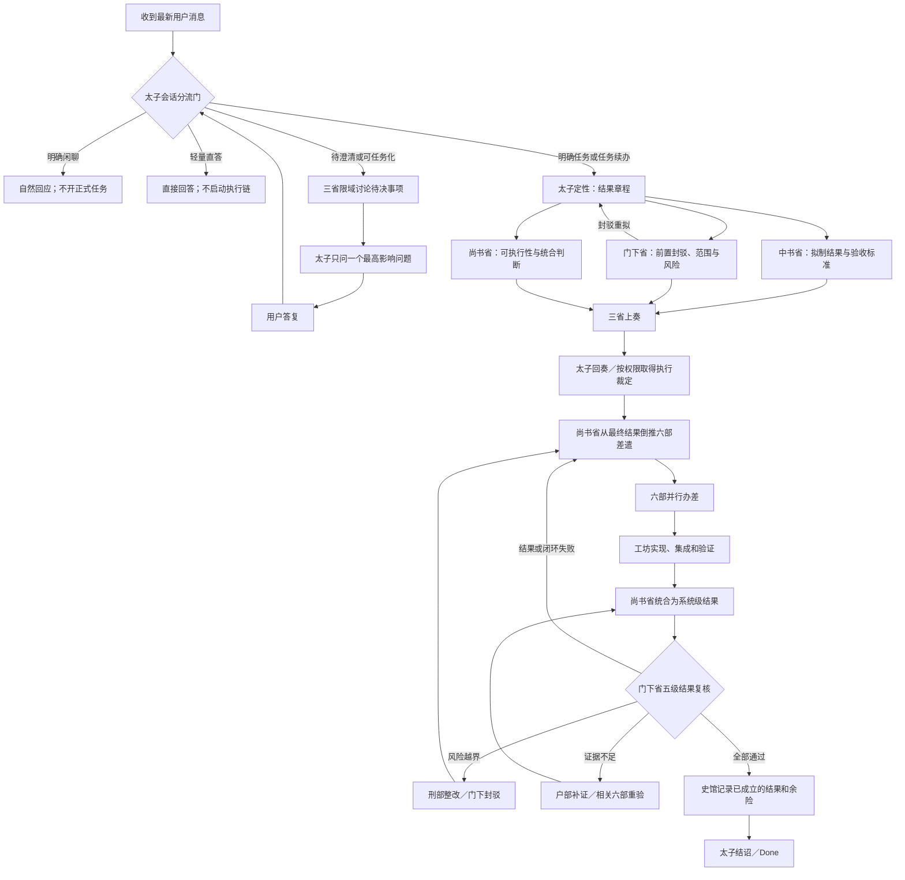

# 三省六部 Skill 结果导向与会话分流整体整改方案

- 日期：2026-07-12
- 基线：`release/beta0.5.9`，commit `040f707`
- 状态：方案完成，尚未实施
- 适用对象：`court-capability-router`
- 本文边界：只定义拟整改语义、流程、字段、测试和实施顺序；不代表代码、规范、运行时或史馆已经完成整改

## 1. 整改目标

在保持三省六部官署职责、上下级关系和正式状态链不变的前提下，把以下裁定优先级变成全链路的共同语义：

> 最终可用结果 > 功能闭环且不退化 > 风险边界 > 可验证证据 > 文档与单项任务完成

同时在“太子定性”之前和之中建立明确的会话分流门，先判断用户当前是在闲聊、请求轻量回答、下达明确任务，还是表达了可能转化为任务但尚不明确的意图。

整改后的核心不是新增一个脱离古制体系的“结果官署”，而是让结果优先级成为太子、三省、尚书省、六部、门下复核和史馆实录共同使用的裁定顺序。

## 2. 核心语义

### 2.1 `>` 表示裁定优先级，不表示机械执行顺序

- 最终结果从太子定性时就必须明确。
- 风险边界从开朝到结诏全程有效，不等到功能完成后才检查。
- 证据在办差过程中持续收集，而不是结束时补写一段说明。
- 文档和单项任务完成只能支持结果成立，不能替代结果成立。
- 如果文档本身是安全使用、部署、操作或交付所必需，它应被提升为“功能闭环”或“风险边界”的组成部分，不再属于普通低优先级文牍。

### 2.2 两类证据必须分开

- `result_plane`：直接证明用户最终能使用什么、端到端行为是否成立、是否发生回归。
- `control_plane`：队列、gate、任务计数、审计计数、史馆记录、文档闭合、单项检查等控制面证据。

控制面证据可以证明过程受控，但不能单独证明最终能力已经落地。

## 3. 整体目标流程



## 4. 太子会话分流门

现有规范已经要求太子“先分类消息、区分闲聊与正式旨意”，但该规则目前分散在核心契约和澄清循环中，尚未成为入口处醒目、稳定、可测试的第一等门禁。本次整改应把它提升为正式的 `conversation_gate`。

### 4.1 先判断会话状态，再判断单条消息

太子必须同时读取两个维度：

1. 当前会话是否存在正在办理、暂停、受阻或等待用户答复的正式任务。
2. 最新消息与该任务的关系，是续办、修正、旁支闲聊、新任务，还是关系不明。

不能只看单条消息的关键词，也不能因为当前存在正式任务，就把用户后续每句话都自动解释为改旨。

### 4.2 建议分类

| 分类 | 判定标准 | 路由 |
| --- | --- | --- |
| `CASUAL_CHAT` | 明确寒暄、情绪表达、随意讨论，没有要求产物、分析、操作或持续目标 | 自然回应；不开正式任务、不写运行账本 |
| `TRIVIAL_DIRECT` | 目标明确、无需工具、无状态变更、无风险、无需持续执行的简单问题 | 太子直接回答；不启动完整三省六部执行链 |
| `FORMAL_TASK` | 有明确目标、对象、期望产物或动作，请求分析、审查、设计、修改、执行、验证等 | 建立结果章程，进入三省会审 |
| `TASK_CANDIDATE` | 用户表达痛点、愿望、设想或可行动问题，但没有明确是否希望形成正式任务 | 三省先讨论任务化影响，太子询问是否转为任务及期望结果 |
| `AMBIGUOUS` | 无法可靠判断是闲聊还是任务，或关键目标、对象、动作类别不明 | 不猜测；只问一个最高影响问题 |
| `TASK_CONTINUATION` | “继续”“按方案进行”“再检查”等明确承接当前任务 | 沿当前结果章程继续，必要时重新三省会审 |
| `TASK_CORRECTION` | 用户修改范围、权限、非目标、验收标准、执行方式或停止条件 | 最新旨意覆盖旧章程；暂停原执行并返回三省复议 |
| `SIDE_CHAT` | 正式任务进行中，但最新消息明显是与任务无关的闲聊或插话 | 回应插话；不得暗中取消、完成或改写在办任务 |
| `UNCLEAR_RELATION` | 存在在办任务，但不确定最新消息是补充当前任务还是另开任务 | 太子询问“补充当前任务还是新任务” |

### 4.3 判定矩阵

| 当前会话 | 最新消息 | 应有行为 |
| --- | --- | --- |
| 无在办任务 | 明确寒暄或随意聊天 | `CASUAL_CHAT`，自然回应 |
| 无在办任务 | 明确简单问题且无需工具 | `TRIVIAL_DIRECT`，直接回答 |
| 无在办任务 | 明确目标、对象和交付物 | `FORMAL_TASK`，进入结果章程 |
| 无在办任务 | 只有痛点或设想，没有请求动作 | `TASK_CANDIDATE`，询问是否任务化 |
| 无在办任务 | 闲聊和任务信号强度接近 | `AMBIGUOUS`，只问一个分流问题 |
| 有在办任务 | “继续”“补充以下要求” | `TASK_CONTINUATION` 或 `TASK_CORRECTION` |
| 有在办任务 | 明确修改为“只读”“不执行”“换目标路径” | `TASK_CORRECTION`，更新章程后重新会审 |
| 有在办任务 | 无关寒暄或旁支话题 | `SIDE_CHAT`，任务状态保持不变 |
| 有在办任务 | 既像补充又像新任务 | `UNCLEAR_RELATION`，询问任务归属 |
| 暂停或受阻任务 | 用户提供缺失条件 | 重新三省复议，确认是否恢复 |

### 4.4 拿不准或可以转成任务时的询问规则

1. 只问一个最高影响问题，不批量询问。
2. 问题首先解决“是否任务化”或“属于哪个任务”，其次才是执行细节。
3. 问题必须能改变路由、边界、结果定义或执行授权。
4. 能通过本地上下文或低成本只读检查确定的事实，不应转问用户。
5. 在用户明确同意任务化之前，不创建正式执行任务、不派遣六部、不实施写入。
6. 每次用户回答后重新分类；若仍有新的实质不确定性，再进行新一轮三省讨论和单问题上奏。

建议问法：

- `太子上奏下一项问题：你希望只是随意讨论，还是将它作为正式任务，由我输出方案或继续处理？`
- `太子上奏下一项问题：这条要求是补充当前任务，还是另开一个独立任务？`
- `太子上奏下一项问题：你希望我只分析原因，还是也实施修复？`

### 4.5 会话分流输出契约

建议形成以下结构化判定，但闲聊本身不必写入正式任务账本：

```yaml
conversation_gate:
  active_decree: true | false
  active_decree_state: NONE | ACTIVE | PAUSED | BLOCKED | WAITING_USER
  message_class: CASUAL_CHAT | TRIVIAL_DIRECT | FORMAL_TASK | TASK_CANDIDATE | AMBIGUOUS | TASK_CONTINUATION | TASK_CORRECTION | SIDE_CHAT | UNCLEAR_RELATION
  confidence: HIGH | MEDIUM | LOW
  relation_to_active_decree: NONE | CONTINUES | CORRECTS | SIDE_CHAT | NEW_TASK | UNCLEAR
  taskization_consent: NOT_REQUIRED | EXPLICIT | PENDING
  next_route: CASUAL_REPLY | DIRECT_ANSWER | THREE_DEPARTMENTS | SINGLE_QUESTION
  question: "仅在 SINGLE_QUESTION 时填写"
  rationale: "简短、可审计的分流理由"
```

正式运行时任务只应在 `FORMAL_TASK`、已确认的 `TASK_CANDIDATE`、`TASK_CONTINUATION` 或 `TASK_CORRECTION` 路由下创建或更新。

## 5. 太子结果定性

进入正式任务后，太子不先列待办清单，而是建立“结果章程”：

- `任务类型`：实现、运维、发布、审查、方案、研究、回答等。
- `最终可用结果`：任务结束后用户实际获得什么。
- `用户可用场景`：用户届时能完成什么动作。
- `功能闭环`：哪些端到端场景必须成立。
- `不退化要求`：哪些既有行为必须保持。
- `风险边界`：权限、数据、成本、破坏性和外部状态边界。
- `验收标准`：阻断性与非阻断性标准。
- `证据要求`：哪些证据直接证明用户结果，哪些只是控制面证据。
- `停止门禁`：何时暂停、封驳、受阻或取消。
- `史馆策略`：何时记录，何时因用户边界不得写入。

不同任务的最终可用结果：

- 实现任务：已集成、能够实际运行的能力。
- 运维任务：目标系统已经达到并保持预期状态。
- 审查任务：有证据支持、可指导决策的发现和整改建议。
- 方案任务：范围、决策、步骤、风险和验收标准完备的可实施方案。
- 回答任务：直接、正确并解决用户问题的答案。

## 6. 三省会审

### 6.1 中书省拟旨

回答“任务到底要求什么”：

- 将结果章程写成可执行旨意。
- 明确用户可用结果和阻断性验收标准。
- 区分系统级结果、子任务产物和普通文档。
- 对尚未确定的事项拟定单一澄清问题。

### 6.2 门下省前置封驳

回答“是否可以这样办、是否存在假完成”：

- 审查范围漂移和未授权动作。
- 识别“gate 通过即结果完成”“文档闭合即能力落地”等假完成路径。
- 审查风险、负面场景和不退化要求。
- 对不可验证、过度宽泛或与用户目标无关的验收标准封驳。

### 6.3 尚书省可执行性会审

回答“批准后如何真正形成结果”：

- 识别依赖、集成点、资源、六部职责和顺序。
- 判断哪些工作适合并行，哪些必须串行。
- 规划失败后的回退、重派和重验路径。
- 不得以六部任务全部关闭代替系统级统合。

三省完成各自职责后形成 `三省上奏`，由太子综合为 `太子回奏`；中书省和门下省不得越过尚书省直接指挥六部。

## 7. 尚书省倒推分派与六部结果契约

尚书省必须从最终可用结果反向拆解差遣。每份差遣至少包含：

- 对最终结果贡献什么。
- 交付什么真实产物、状态或能力。
- 对应哪条验收标准。
- 需要什么结果证据。
- 可能导致什么回归或风险。
- 失败后由谁重办、返回哪个状态。
- 什么条件下必须停止。

| 官署 | 结果导向职责 | 不得被误当成最终结果的内容 |
| --- | --- | --- |
| 吏部 | 适任 skill、agent、MCP、CLI 和责任主体选择 | 官籍完整、agent 已启动 |
| 户部 | 环境、依赖、路径、预算、证据覆盖和可复现条件 | 预算表、计数、账本完整 |
| 礼部 | 用户契约、验收表达、必要操作文档和报告体例 | 文档完成、格式通过 |
| 兵部 | 实施战术、并行调度、集成、故障恢复和重试 | 队列清空、调度完成 |
| 刑部 | 风险边界、负面测试、回归审查和封驳条件 | 风险清单已填写 |
| 工部 | 实际营造、集成、运行验证和交付真实能力 | 文件已修改、单测数量通过 |

六部只向尚书省回奏。尚书省负责把六部成果统合成系统级结果，再送门下省复核。

## 8. 门下省五级结果复核

门下省按以下优先级裁定：

1. **最终结果门**：是否存在真实产物或目标状态；用户现在能用它做什么。
2. **闭环与不退化门**：端到端场景是否成立；关键既有能力是否保持。
3. **风险边界门**：权限、数据、安全、成本、破坏性和残余风险是否可接受。
4. **可验证证据门**：是否存在新鲜、可追溯、直接指向用户结果的证据。
5. **文牍与单项任务门**：普通文档、子任务、奏报和史馆字段是否一致。

失败路由：

| 失败层 | 裁定 | 返回路径 |
| --- | --- | --- |
| 最终结果缺失 | 不得 `Done` | 尚书省重新统合，工部重新营造 |
| 功能未闭环或发生回归 | 不得 `Done` | 兵部、工部重办，刑部复审 |
| 风险越界 | 封驳或受阻 | 刑部提出整改条件，尚书省重排 |
| 证据不足 | `PARTIAL` 或 `NOT_VERIFIED` | 户部组织补证，相关六部重验 |
| 普通文档不完整 | 可按影响程度整改或 `DONE_WITH_CONCERNS` | 礼部补齐 |
| 强制安全文档或硬史馆字段缺失 | 提升为闭环或风险问题 | 不得以“只是文档”绕过 |

## 9. 史馆与结诏

史馆不是第七个六部官署，也不创造完成事实。正确关系是：

> 门下确认结果成立 → 史馆记录结果、证据、余险和回退过程 → 太子结诏

因此：

- 史馆 checkpoint 本身不等于完成。
- 发布 gate、审计计数和任务关闭数量不等于完成。
- 史馆必须记录门下的结果裁定，而不是只记录“流程已走完”。
- 文件系统写入被用户禁止时，必须报告 `authority_blocked/no-audit-write-boundary`，不得编造诏令编号、谱系或归档状态。

太子最终回奏必须直接回答：

1. 实际形成了什么真实能力或结果。
2. 用户现在最终可以拿它做什么。
3. 哪些能力仍未形成、有哪些残余风险。

## 10. 与运行时状态机的映射

正式任务仍可保持现有主链：

```text
Pending
-> Taizi
-> ThreeDepartments
-> ThreeDepartmentsPetition
-> TaiziReply
-> ShangshuDispatch
-> SixMinistries
-> Workshops
-> MenxiaReview
-> ShiguanRecorded
-> Done
```

拟增加或强化的语义：

- `conversation_gate` 位于正式 `Pending` 任务创建之前。
- `Taizi` 必须持有结果章程，不能只有任务清单。
- `TASK_CORRECTION` 必须更新章程并返回 `ThreeDepartments` 复议。
- `MenxiaReview` 必须执行五级结果复核。
- `ShiguanRecorded` 只能记录门下已接受的结果，不能反向证明结果成立。
- `Done` 只能由结构化结果验收产生，普通 `transition --to-state Done --evidence ...` 不得绕过。
- `PARTIAL`、`BLOCKED`、`NOT_VERIFIED` 不得伪装成 `Done`。

## 11. 拟整改文件

### 11.1 规范层

- `SKILL.md`
  - 在正式流程前新增会话分流硬门禁摘要。
  - 写入结果优先级和控制面证据不得替代用户结果的硬语义。
- `references/court-core-contract.md`
  - 定义会话状态、消息分类、任务化同意和最新旨意与旁支闲聊的关系。
- `references/court-offices-dispatch.md`
  - 扩展 Clarification Loop，加入闲聊、轻答、任务候选、在办任务修正和任务归属问题。
- `references/court-startup-authority.md`
  - 明确会话分流发生在正式任务创建和执行权限门之前。
- `references/court-state-runtime-agents.md`
  - 规定正式运行时只接收已分类任务；任务修正必须重回三省。
- `references/court-closeout-validation.md`
  - 增加最终可用结果、功能闭环、不退化、风险边界和结果证据字段。
- `references/sections/court-closeout-memorial-format.md`
  - 保持十四个用户侧标签数量不变，将结果字段嵌入既有标签。

### 11.2 实现层

- 新增 `scripts/court_intake_gate.py`
  - 集中实现会话分流契约和 fail-closed 校验。
- 新增 `scripts/check_court_intake_gate.py`
  - 覆盖闲聊、轻答、任务候选、任务修正和任务归属测试。
- 新增 `scripts/court_outcome_gate.py`
  - 集中实现结构化结果验收。
- 新增 `scripts/check_court_outcome_gate.py`
  - 验证控制面全通过但用户结果缺失时不得完成。
- 修改 `scripts/court_runtime.py`
  - 运行时 schema 升级。
  - 正式任务记录会话分类和结果章程。
  - 新增原子化 `complete` 命令。
  - 禁止普通 Done transition 绕过结果门。
- 修改 `scripts/check_court_runtime.py`
  - 增加会话修正、结果门和旧账本迁移测试。
- 修改 `scripts/release_gate_manifest.py`
  - 增加 `court_intake_gate` 和 `court_outcome_acceptance` 必跑项。
- 修改 `references/manifests/release-gates.v1.json`
  - 与源码发布门禁保持一致。
- 更新 response few-shot、draft fixtures 及对应检查脚本。

## 12. 关键测试矩阵

### 12.1 会话分流

| 输入场景 | 预期 |
| --- | --- |
| “你好” | `CASUAL_CHAT`；不开任务 |
| “解释一下什么是 worktree” | 满足轻答条件时 `TRIVIAL_DIRECT` |
| “只读审查这个仓库并给整改方案” | `FORMAL_TASK` |
| “最近这个项目有点乱” | `TASK_CANDIDATE`；询问是否要正式审查或整理 |
| “你觉得这个想法怎么样”且上下文不足 | `AMBIGUOUS`；询问随聊还是正式评审 |
| 在办任务中用户说“继续” | `TASK_CONTINUATION` |
| 在办任务中用户说“不要改文件，只审查” | `TASK_CORRECTION`；更新章程并复议 |
| 在办任务中出现无关寒暄 | `SIDE_CHAT`；原任务状态不变 |
| 无法判断是补充还是新任务 | `UNCLEAR_RELATION`；只问任务归属 |
| 一次存在多个澄清点 | 每轮只问一个最高影响问题 |

### 12.2 结果验收

- 非空但泛化的 `transition Done` 必须被拒绝。
- 队列、gate、文档和审计计数全部通过，但没有最终可用结果时必须被拒绝。
- 实现任务缺少端到端闭环或不退化证据时必须被拒绝。
- `PARTIAL`、`BLOCKED` 和 `NOT_VERIFIED` 不能映射为 `Done`。
- 方案或审查任务可以将不适用的功能项标为 `NOT_APPLICABLE`，但必须给出理由并证明方案或审查结果本身可用。
- 旧 schema 任务迁移后不得从自由文本 `last_evidence` 自动推断完成。

## 13. 建议实施顺序

1. 固化会话分类、结果优先级和五级验收规范。
2. 先添加会话分流和假完成反例测试。
3. 实现 `court_intake_gate.py`，但暂不改变运行时完成行为。
4. 实现 `court_outcome_gate.py` 和原子化完成命令。
5. 升级运行时 schema 和旧账本兼容迁移。
6. 更新结诏格式、few-shot、draft fixtures 和发布门禁。
7. 执行全套验证、语义再载入和真实史馆归档。
8. 只有门下复核和发布门禁都通过后，才同步活动副本或打包发布。

## 14. 最终验收条件

- 明确闲聊不会创建正式任务或触发六部执行。
- 明确任务不会被误判为闲聊而跳过结果章程。
- 可任务化但意图不明时，太子只问一个最高影响问题。
- 在办任务的旁支闲聊不会暗中改变、取消或完成任务。
- 用户修正会覆盖旧章程并重新进入三省复议。
- 六部任务全部完成但系统级结果缺失时，门下仍会拒绝 `Done`。
- 只有控制面证据而没有用户结果证据时，运行时拒绝完成。
- 史馆记录只记录已经成立或明确未成立的结果，不再把归档本身当成结果。

## 15. 非目标

本轮方案不调整：

- `super并行` 与 `superCC` 的拓扑边界。
- zellij、squad、可见官署和 wake/closeout 行为。
- agent admission、模型路由和并发容量算法。
- 史馆编号、古制谱系和归档生成算法。
- 现有十四行用户侧结诏标签数量。

## 16. 主要风险及缓解

| 风险 | 缓解 |
| --- | --- |
| 过度正式化，普通闲聊也开朝 | 设置 `CASUAL_CHAT` 和严格的轻答旁路 |
| 过度任务化，把用户感慨变成执行 | `TASK_CANDIDATE` 必须取得任务化同意 |
| 频繁追问造成体验负担 | 只问最高影响问题；可由本地低成本只读检查解决的事项不问 |
| 在办任务与旁支消息混淆 | 显式 `relation_to_active_decree` 字段 |
| 自由文本证据仍可伪造完成 | 结构化结果证据、证据分类和结果门联动 |
| schema 升级破坏旧账本 | 旧任务迁移为 `UNASSESSED`，完成时 fail closed，不自动推断通过 |

## 17. 本文状态

本文只是整体整改方案。生成本文时未修改 skill 规范、运行时代码、测试、发布门禁或活动安装副本，也未运行归档和打包流程。
