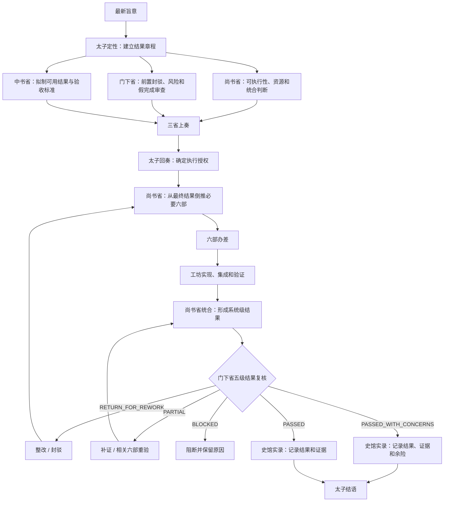

# Decretum Matrix 客观整改实施计划书

> **实施要求：** 执行本计划前，执行者必须完整读取 `C:\Users\32893\.agents\skills\decretum-matrix\SKILL.md`。本计划按任务逐项执行；每项先取得现状证据和失败用例，再修改产品源。

**目标：** 本整改作为新版本 `beta1.0.2` 的分支工作执行。以用户明确要求、`beta0.5.9` 实际行为和上一问题基线 `beta1.0.1@9774a1415b906b357985e462e74efaf842f45602` 实际行为为依据，在不删除功能、不改变未获授权语义的前提下，处理启动速度、脚本层级、CLI 调用、项目目录外运行问题和尚书统六部语义稀释问题。

**计划性质：** 本文件是给用户审阅的中文计划书。文件中的事实、要求、未决项和项目级工作分别列示，不将工程实现假设写成产品语义。

---

## 一、证据规则

本计划只允许使用以下四类信息：

| 标记 | 含义 | 使用规则 |
| --- | --- | --- |
| `U` | 用户明确要求 | 直接作为产品语义，不再重新解释。 |
| `H` | `beta0.5.9` Git 对象中的实际行为 | 作为历史功能基线。 |
| `C` | 上一问题基线 `beta1.0.1@9774a141` 及当前 `release/beta1.0.2` 工作树的实际行为 | 作为当前功能和兼容面基线。 |
| `X` | 尚未由 `U/H/C` 证明的内容 | 保持现状，禁止修改；不得由执行者补充推断。 |

所有实施项必须记录：

```text
要求来源：U | H | C
当前行为证据：文件、命令、输出或持久化结果
拟修改内容：仅描述实际改动
语义变化：必须为 NO；若为 YES，停止并交用户决定
功能删除：必须为 NO
验收命令：可重复执行的真实命令
```

任何一项缺少来源或当前证据时，状态为 `X`，该项不得进入产品源修改。

## 二、Skill 的确定语义

本节只记录已经明确的 Skill 产品语义，不记录项目发布、安装或法律检查。

### 2.1 Skill 定义

| 编号 | 来源 | 确定内容 |
| --- | --- | --- |
| S-01 | U | Decretum Matrix 是围绕“诏令”的多-agent 协作体系。 |
| S-02 | U | 正式任务的默认表现为三省六部流程。 |
| S-03 | U | 史馆/知识库为跨-agent 协作提供记忆能力。 |
| S-04 | U | 任务分配遵循适用场景原则；使用多少流程由任务复杂度决定。 |
| S-05 | U | 增加功能不等于增加流程层级、验证层级或运行复杂度。 |
| S-06 | U | 启动和加载目标不是一味短而快，而是路径清晰、加载边界明确、按场景一次走对；若某内容必须分两次加载，入口必须明确写出第一次加载什么、第二次何时加载什么。 |

### 2.1.1 加载路径原则

| 层级 | 必须清楚说明 | 不允许 |
| --- | --- | --- |
| 入口 `SKILL.md` | Skill 定义、硬边界、三权/运行方式、层级、场景分流、当前行为到 reference 的加载路径。 | 为追求短而省略会导致首次加载走错路的关键信息。 |
| governing reference | 当前场景需要的完整规则、例外、验收和脚本入口。 | 在普通开朝、闲聊或轻量路径无条件全量加载全部 reference。 |
| focused/project checker | 开发、验收、安装、发布和诊断时显式调用。 | 混入普通 Skill runtime，导致“回复 OK”也跑工程检查链。 |

实现要求：如果一个场景需要两阶段加载，入口必须先说明“第一阶段加载入口和当前场景 reference，第二阶段只在进入正式任务、结诏、superCC、安装或发布时加载对应 reference”。不得让模型先误加载，再靠二次修正补救。

### 2.2 太子与场景分流

| 编号 | 来源 | 确定内容 |
| --- | --- | --- |
| S-10 | U | 太子负责语义差分和场景定性。 |
| S-11 | U | 场景至少包括闲聊/轻量交流、正式任务、任务延续、任务纠正和主动结诏。 |
| S-12 | U | 闲聊适用于随便的轻量任务或聊天。 |
| S-13 | U | 闲聊不自动结诏。 |
| S-14 | U | 用户主动要求结诏时，汇总当前单会话内尚未结诏的聊天、闲聊、轻量任务、正式任务、纠正和结果。 |
| S-15 | U | 会话结诏不得额外富化为与原会话无关的材料。 |

### 2.3 正式三省六部流程

#### 图一：正式三省六部主流程

原图：[`微信图片_20260720184909_157_108.jpg`](../../../../../docs/微信图片_20260720184909_157_108.jpg)；源路径：`D:\project\docs\微信图片_20260720184909_157_108.jpg`



#### 图二：整改前后差异与场景分流

原图：[`screenshot_20260712_144822_com.netease.uuremote.jpg`](../../../../../docs/screenshot_20260712_144822_com.netease.uuremote.jpg)；源路径：`D:\project\docs\screenshot_20260712_144822_com.netease.uuremote.jpg`

图例沿用原图：灰色表示保留主链，蓝色表示新增分流，黄色表示强化节点，红色表示阻断节点。

```mermaid
flowchart TB
    subgraph BEFORE["整改前：现行主链"]
        B1["用户最新消息"] --> B2["太子初步分类"]
        B2 --> B3["语义章程"]
        B3 --> B4["三省会商 / 定调"]
        B4 --> B5["太子回奏"]
        B5 --> B6["尚书按职责分派六部"]
        B6 --> B7["六部 / 工坊完成分项任务"]
        B7 --> B8["尚书整合回奏"]
        B8 --> B9["门下综合复核"]
        B9 --> B10["史馆记录"]
        B10 --> B11["Done"]
    end

    subgraph AFTER["整改后：场景分流与结果导向闭环"]
        A1["用户最新消息 + 当前会话状态"] --> A2{"conversation_gate"}

        A2 -->|CASUAL_CHAT / TRIVIAL_DIRECT| A3["闲聊 / 轻答旁路"]
        A3 --> A4["继续当前会话，不自动结诏"]

        A2 -->|TASK_CANDIDATE / AMBIGUOUS / UNCLEAR_RELATION| A5["澄清后重新分类"]
        A5 --> A2

        A2 -->|EXPLICIT_CLOSEOUT| A6["主动结诏：汇总当前会话未结诏内容"]

        A2 -->|FORMAL_TASK / CONTINUATION / CORRECTION| A7["正式任务 / 续办 / 修正"]
        A7 --> A8["太子结果章程：最终可用结果优先"]
        A8 --> A9["三省会审：结果、风险和执行条件"]
        A9 --> A10["太子回奏：确定执行授权"]
        A10 --> A11["尚书从最终结果反向拆解"]
        A11 --> A12["六部按结果办差"]
        A12 --> A13["工坊实现、集成和验证"]
        A13 --> A14["尚书形成系统级可用结果"]
        A14 --> A15{"门下五级结果门"}

        A15 -->|RETURN_FOR_REWORK| A11
        A15 -->|PARTIAL| A16["补证 / 相关六部重验"]
        A16 --> A12
        A15 -->|BLOCKED| A17["封驳 / BLOCKED"]
        A15 -->|PASSED_WITH_CONCERNS| A18["史馆记录结果、证据和余险"]
        A15 -->|PASSED| A19["史馆记录已验证结果"]

        A6 --> A21["史馆记录：当前会话合并结诏"]
        A21 --> A20
        A18 --> A20["太子结语"]
        A19 --> A20
    end

    classDef retained fill:#d9d9d9,stroke:#666,color:#111;
    classDef added fill:#dbeafe,stroke:#3b82f6,color:#111;
    classDef strengthened fill:#fef3c7,stroke:#d6a11d,color:#111;
    classDef blocked fill:#fee2e2,stroke:#dc2626,color:#111;

    class B1,B2,B3,B4,B5,B6,B7,B8,B9,B10,B11 retained;
    class A1,A2,A3,A4,A5,A6,A7 added;
    class A8,A9,A10,A11,A12,A13,A14,A16,A18,A19,A20,A21 strengthened;
    class A15,A17 blocked;
```



图二只表达两类关系：保留的现行主链，以及用户明确要求增加或强化的场景分流和结果闭环。原图中无法可靠辨识的细小文字不作为本计划语义来源。

| 编号 | 来源 | 确定内容 |
| --- | --- | --- |
| S-20 | U | 中书省、门下省、尚书省在太子授权前完成各自审议。 |
| S-21 | U | 尚书省在太子授权后统筹六部；一般正式任务必须由尚书下派对应六部子/孙官署，不得由尚书省代替六部执行六部职责。 |
| S-22 | U/C | 门下省结果复核保留既有五类结果：`PASSED`、`PASSED_WITH_CONCERNS`、`RETURN_FOR_REWORK`、`PARTIAL`、`BLOCKED`。 |
| S-23 | U | 返工回到整改流程；补证或重验交由相关六部；通过后进入史馆与太子结语。 |
| S-24 | U | 只有很简单、单个尚书子线程即可完成且无必要六部专责的任务，才允许尚书省单独执行；该判断必须有结构化理由。 |
| S-25 | U | “派遣对应六部”是职责分解要求；`behavior=serial|parallel` 只决定运行方式，不得作为省略六部职责或由太子/root 直派六部的理由。 |
| S-26 | U | 六部唯一直属上级是尚书；并行时六部必须表现为尚书下派的子/孙官署。 |

### 2.4 官署名称、预载和诏令绑定

| 编号 | 来源 | 确定内容 |
| --- | --- | --- |
| S-30 | U | 官署预载功能最初用于解决官署分配名称不正确的问题。 |
| S-31 | U | 当前采用规范官署名称和语义胶囊维持官署身份及任务语义。 |
| S-32 | U | 官署预载功能必须保留，不得因提速而删除。 |
| S-33 | U | 诏令绑定必须保留，用于防止模型编造、旧任务结果混入和语义漂移。 |
| S-34 | U/C | authority 为 `approval|autonomous|super`；behavior 为 `serial|parallel`；二者正交。 |
| S-35 | U/C | 失效的诏令 revision 必须阻止差遣，差遣数量为零，不能以手工旁路继续。 |

#### 2.4.1 三权与运行方式

三权是“允许做什么”的授权边界；运行方式是“如何组织执行”的调度形态。二者必须分开介绍、分开验证、分开记录。

| 项 | 含义 |
| --- | --- |
| `approval` | 审批权。默认只读、审查、拟定方案或等待用户批准；不得自行写入、发布或改变外部状态。 |
| `autonomous` | 自主权。在用户给定范围内可自行实施本地修改和验证；不得越过范围、执行外部发布或破坏性动作。 |
| `super` | 超级执行权。在明确范围内可连续推进高强度执行、验证和收尾；仍受安全、隐私、预算、写集、发布授权和直接上级层级约束。 |

运行方式单独定义：

| 项 | 含义 |
| --- | --- |
| `serial` | 串行执行。不并行开子线程；但正式任务仍要保留三省六部职责分解，必要六部由尚书按层级下派后串行推进或形成明确职责包，不由太子/root 直派。 |
| `parallel` | 并行执行。允许按层级派生子线程；尚书必须履行统筹六部语义，包括选择对应六部、向六部子/孙官署下达职责、汇总证据和回奏，不得只是系统直接生成六部 admission。 |

本计划不预先规定预载必须读取多少文件、是否采用某种缓存或如何计算校验材料。实际实现方式必须先由现状测量证明问题，再单独提出。

### 2.5 史馆、基础记忆、GBrain 与 Git 联邦

| 编号 | 来源 | 确定内容 |
| --- | --- | --- |
| S-40 | U/H | 史馆既有脚本和三省六部流程已经具备基础记录、索引和召回能力。 |
| S-41 | U | 史馆内容面向人阅读，并允许人工整理和修改。 |
| S-42 | U | GBrain 的主要职责是沉淀和整理，不取代史馆基础记录与召回。 |
| S-43 | U | GBrain 属于明确追加的功能，必须保留。 |
| S-44 | U | Git 联邦用于史馆管理，必须保留。 |
| S-45 | U/H/C | `beta0.5.9` 已形成的史馆记录、索引、树、图、Web、Obsidian 等能力全部作为功能底线；不要求保留当时的旧内部名称或每一个旧脚本文件。 |
| S-46 | U/C | beta1.0.1 中明确新增且有独立价值的史馆功能必须保留；候选脚本只有在不承担 `beta0.5.9` 任一既有能力、用户明确新增功能、历史数据职责或当前独有有效输出，且经脚本价值评估证明无实际调用者后，才可合并或移除。 |

关于 receipt、hash、索引、树、图、Web、Obsidian 的具体触发关系，本计划不作新的推定：

- 在完成 `beta0.5.9` 全部能力、beta1.0.1 实现内容和实际调用者的逐项行为对照前，不修改对应脚本。
- 保留后的正式功能入口、输出和持久化结果必须有明确验收；被判定为重复或无关的脚本不因文件存在本身获得永久兼容资格。
- 不将项目发布/安装校验混入 Skill 的开朝、闲聊或普通任务路径。
- 旧记录、receipt、task 和安装数据继续可读取或迁移；旧内部模块名、旧脚本名和无实际使用者的 wrapper 不自动保留。

### 2.6 CLI 与项目目录外运行

| 编号 | 来源 | 确定内容 |
| --- | --- | --- |
| S-50 | U | CLI 的初衷是简化脚本调用、提升加载速度和兼容性。 |
| S-51 | U | CLI 不应成为新的治理、准入、发布或审计中心。 |
| S-52 | U | 复用现有 CLI，不新增竞争性的总入口。 |
| S-53 | U | 项目目录内运行正常、项目目录外运行异常的问题必须整改。 |
| S-54 | U | 无关 Git 仓库、非 Git 目录、含空格或中文路径以及全局安装环境均属于验收场景。 |
| S-55 | U | `beta0.5.9` 全部能力和用户明确新增功能必须保留可用入口；beta1.0.1 新增脚本及兼容入口按实际功能、必要性、独有价值、调用者和历史数据职责决定保留、合并或移除。 |
| S-56 | U | 只回复 `OK` 是暴露全局启动负担的验收探针，不是单独产品场景；所有任务都必须按实际场景分配流程和运行成本，禁止为 `OK` 字符串建立特化旁路。 |

本计划不以脚本数量增减直接判定质量。正式保留功能必须有可发现入口；被评估为重复、无关或无实际价值的脚本不要求继续出现在帮助和索引中。

#### 2.6.1 脚本价值评估规则

每个 beta1.0.1 新增或大幅改写的脚本必须记录以下事实：

| 评估项 | 需要回答的问题 | 证据 |
| --- | --- | --- |
| 实现内容 | 脚本实际完成什么输入、处理和输出？ | 源码、`--help`、真实运行输出。 |
| 0.5.9 能力关系 | 实现的是 `beta0.5.9` 哪一项既有能力？ | `beta0.5.9` 对应功能和当前调用链。 |
| 明确新增关系 | 是否实现 GBrain、Git 联邦、官署语义胶囊等用户明确新增功能？ | 用户要求和当前生产入口。 |
| 实际调用者 | 哪些模块、CLI、文档、测试、安装包或外部流程调用它？ | `rg` 调用图、manifest、package 内容和运行证据。 |
| 独有价值 | 是否存在其他脚本提供相同结果？删除后会缺少什么能力？ | 输入/输出对照测试。 |
| 历史职责 | 是否负责读取、解释或迁移旧记录、receipt、task 或安装数据？ | 历史 fixture 和迁移测试。 |
| 运行代价 | 在真实路径中增加多少读取、子进程、Git 调用或等待？ | 任务 1 的运行基线。 |

脚本处置只允许以下六类结论：

| 结论 | 含义 |
| --- | --- |
| `KEEP_BASELINE` | 直接承担 `beta0.5.9` 既有能力，保留。 |
| `KEEP_EXPLICIT` | 承担用户明确新增功能，保留。 |
| `MERGE_FUNCTION` | 功能有价值，但与另一实现重复；先迁移功能和调用者，再移除重复脚本。 |
| `RETIRE_ENTRY` | 仅为旧内部名称或无调用者 wrapper；历史数据不依赖该入口，可移除入口。 |
| `REMOVE_REDUNDANT` | 不承担 `beta0.5.9` 能力或明确新增功能、无独有输出、无调用者、无历史职责，可移除。 |
| `X_NO_DECISION` | 证据不足，保持现状，不实施。 |

脚本合并或移除必须同时满足：

1. `beta0.5.9` 每项能力仍有正式入口。
2. 用户明确新增功能仍有正式入口。
3. 原脚本没有未迁移的独有输出或实际调用者。
4. 旧记录、receipt、task 和安装数据仍可读取或迁移。
5. focused 测试和功能保全测试均通过。

#### 2.6.2 beta1.0.1 后增脚本与校验是首要整改对象

`beta0.5.9 -> beta1.0.1@9774a141` 期间新增的以下内容全部进入重点候选集：

- `scripts/` 下新增的运行脚本。
- 新增的 `check_*`、gate、verifier 和 doctor 脚本。
- 新增的 manifest、receipt、journal、ledger 和 compatibility adapter。
- 被 CLI 注册但不直接形成 Skill 有效产出的命令。
- 被闲聊、开朝、普通任务或结诏路径自动调用的项目级检查。

候选项的价值分类固定为：

| 价值分类 | 客观条件 | 处置方向 |
| --- | --- | --- |
| `VALUE_BASELINE` | 直接形成 `beta0.5.9` 既有能力的有效产出。 | 保留或在功能等价前提下合并实现。 |
| `VALUE_EXPLICIT` | 直接形成用户明确新增功能的有效产出。 | 保留或在功能等价前提下合并实现。 |
| `VALUE_HISTORY` | 负责读取或迁移旧记录、receipt、task 或安装数据。 | 保留读取/迁移能力；入口形式可调整。 |
| `VALUE_PROJECT_ONLY` | 仅在开发、打包、安装或发布阶段有作用。 | 从 Skill 运行链移除，转入项目级阶段。 |
| `VALUE_DUPLICATE` | 输出已由另一实现完整提供，没有独有结果。 | 迁移调用者后合并或移除。 |
| `VALUE_NONE` | 无实际调用者，不形成用户产出，不承担安全或历史职责。 | 移除。 |
| `VALUE_UNKNOWN` | 证据不足。 | 保持现状，继续取证。 |

“有效产出”只包括：

1. 用户可用的任务结果。
2. 用户明确要求的 Skill 功能结果。
3. 为这些结果不可缺少的安全阻断。
4. 必须保留的历史数据读取或迁移结果。
5. 明确属于项目阶段的工程验收结果。

仅生成更多 schema、hash、receipt、日志、镜像字段或二次证明，不自动构成有效产出。候选项如果增加耗时、文件读取、子进程或维护面，同时没有上述产出，归类为 `VALUE_DUPLICATE` 或 `VALUE_NONE`。

#### 2.6.3 场景成本分配不得对单一输入特化

`OK` 只作为低复杂度场景的一个 canary。产品不得依据精确字符串、关键词、消息长度或测试名称选择快速旁路。

场景成本矩阵为：

| 场景类别 | 必须保留的处理 | 不得自动附加的处理 |
| --- | --- | --- |
| 闲聊 / 轻答 | 太子场景判定、直接回复、保留当前会话状态。 | 三省、六部、子 agent、史馆写入、项目级检查。 |
| 轻量任务 | 太子场景判定，以及完成该任务实际需要的工具或脚本。 | 与任务结果无关的官署、checker、gate、Git、安装或发布流程。 |
| 正式串行任务 | 正式三省流程、太子授权、尚书统筹并记录必要六部职责；behavior 保持 serial，六部职责可串行执行。 | 子 agent 并行、尚书长期代替必要六部办差、与任务结果无关的项目级检查。 |
| 正式并行任务 | 正式三省流程、太子授权、尚书选择必要六部并真实并行执行。 | 为填满容量而派生无关官署、漏派必要六部，以及与结果无关的检查链。 |
| 主动结诏 | 汇总本会话未结诏内容，并执行既有史馆结诏能力。 | 重新执行已完成任务或启动无关项目检查。 |
| 项目工程任务 | 用户或开发流程明确要求的测试、安装、打包或发布步骤。 | 将这些步骤反向加入普通 Skill 场景。 |

场景分类必须由结构化事实决定，包括任务关系、是否需要工具、是否改变状态、风险、authority、behavior 和明确的结诏意图。不得使用 `if text == "OK"`、禁词表、关键词黑白名单或测试专用环境变量实现快速路径。

验收使用一组语义变体，而不是单一 `OK`：

- 相同闲聊意图的不同措辞、空格和语言形式应选择相同流程层级。
- 不同轻量任务可调用各自必要工具，但不应进入无关正式流程。
- 文本很短的正式任务仍进入正式流程，不能因短文本走闲聊旁路。
- 文本很长的闲聊仍按闲聊处理，不能因长度进入正式流程。
- `OK` canary 只验证低复杂度路径没有全局脚本负担。

场景成本验收固定输出：

```text
SCENE_COST_ALLOCATION=PASS
literal_input_special_cases=0
keyword_filter_routes=0
test_only_fastpaths=0
lightweight_unrelated_script_calls=0
formal_required_flow_missing=0
project_gates_in_skill_runtime=0
duration_not_slower_than_beta0.5.9_by_scene=true
```

首要整改结果必须记录：

```text
POST_059_SCRIPT_REVIEW=PASS
candidates=<count>
value_baseline=<count>
value_explicit=<count>
value_history=<count>
value_project_only=<count>
value_duplicate=<count>
value_none=<count>
value_unknown=0
skill_runtime_checker_calls_before=<count>
skill_runtime_checker_calls_after=<count>
user_output_changed=0
```

### 2.7 native 与 superCC

| 编号 | 来源 | 确定内容 |
| --- | --- | --- |
| S-60 | U/C | native super 与 superCC 是不同启动/运行环境，不在同一任务中互相切换。 |
| S-61 | U | 当前桌面环境不支持把 superCC 作为标准验收环境。 |
| S-62 | U | 可以进行 superCC 尝试，但结果不能作为普通 Skill 的统一验收标准。 |

## 三、Skill 功能保全门禁

### 3.1 受保护范围

受保护范围是以下集合的并集：

1. `beta0.5.9` 已形成的全部能力，不绑定旧内部名称和旧文件结构。
2. 用户明确追加或明确要求保留的功能。
3. 当前 beta1.0.1 中经脚本价值评估确认具有独有价值、实际调用者或历史数据职责的功能。
4. 旧记录、receipt、task 和安装数据的读取/迁移能力。

beta1.0.1 中“存在一个脚本文件”本身不构成受保护理由。

### 3.2 “功能未删除”的判定

每项功能必须同时满足：

| 检查项 | 通过条件 |
| --- | --- |
| 正式入口 | 每项保留能力存在一个明确、可测试、可发现的正式入口；不要求保留全部旧脚本名和 wrapper。 |
| 输入合同 | 保留能力的正式输入合同继续有效；被移除的重复入口不要求维持同名参数。 |
| 输出合同 | 保留能力的关键结果、状态和错误语义不丢失；重复脚本的重复 envelope 不单独视为功能。 |
| 持久化结果 | `beta0.5.9` 能力及明确新增功能需要的记录、索引、树、图、同步或管理结果继续产生。 |
| 运行语义 | `beta0.5.9` 能力和用户明确语义不因脚本合并或移除而改变。 |
| 历史数据兼容 | 旧记录、旧 receipt、旧 task 和旧安装数据仍可读取或迁移。 |
| 内部名称兼容 | 旧项目名、旧模块名、旧脚本名和无调用者 wrapper 不属于强制兼容项。 |

门禁输出固定为：

```text
SKILL_FEATURE_PRESERVATION=PASS
beta059_capability_lost=0
explicit_feature_lost=0
historical_data_unreadable=0
retained_contract_regression=0
scripts_keep=<count>
scripts_merge=<count>
scripts_retire=<count>
scripts_remove=<count>
unknown=0
```

`beta059_capability_lost`、`explicit_feature_lost`、`historical_data_unreadable`、`retained_contract_regression` 或 `unknown` 任一非零时停止实施。脚本的 merge/retire/remove 数量是评估结果，不自动表示失败。

## 四、禁止推测门禁

以下内容不得直接写入实现方案：

- 未测量前指定“缓存、增量、去重、懒加载”为最终方案。
- 未验证前断定某个 hash、receipt、索引、树或图属于冗余。
- 未验证前改变史馆写入次数、触发点或同步方式。
- 未验证前规定 CLI 命令数量、公开范围或帮助结构。
- 未验证前认定某个 beta1.0.1 功能可以回退到 beta0.5.9。
- 以代码规模、文件数量或个人偏好决定功能取舍。

每个性能问题必须先形成以下事实记录：

```text
场景：
输入：
当前调用链：
当前耗时：
文件读取：
子进程：
Git 调用：
持久化动作：
重复动作证据：
功能输出：
```

没有该记录，不得修改对应实现。

## 五、Skill 与项目级能力边界

### 5.1 Skill 范围

本计划的 Skill 范围只包括：

- 场景分流与太子语义差分。
- 三省六部协作流程。
- 官署名称、职责、预载和诏令绑定。
- authority、behavior、native/superCC 运行语义。
- 史馆基础记忆、GBrain 和 Git 联邦。
- Skill 使用的 CLI 和脚本入口。
- 项目目录外的 Skill 运行兼容性。

### 5.2 项目级工程范围

以下内容属于项目工程和发布流程，不属于 Skill 功能定义：

- 源码质量检查。
- 打包和产物生成。
- 安装、升级、迁移和回滚测试。
- 隐私、法律、许可证和 SBOM 检查。
- GitHub Release、tag、npm publish 和远端复核。

这些能力在项目中继续存在，但处理规则是：

- 不写入 Skill 功能保全表。
- 不参与闲聊、轻量任务或普通开朝路径。
- 只在相应的项目开发、打包、安装或发布阶段执行。
- 不以项目级检查数量定义 Skill 的复杂度或功能完整性。

## 六、当前工作树状态

- managed child worktree：`D:\project\worktrees\decretum-matrix\decretum-matrix-beta1.0.1-startup-fastpath`
- branch：`release/beta1.0.2`
- target version：`beta1.0.2`
- 接受基线 HEAD：`9774a1415b906b357985e462e74efaf842f45602`
- 当前未提交的 Task 1 产品改动处于隔离状态。
- 隔离改动不得暂存、提交或继续扩大，直到完成本计划的语义矩阵和功能保全门禁。
- `D:\project` 根目录既有脏改动不得修改。
- 根目录和 child index 在每个门禁点必须为空。

## 七、实施任务

### 任务 0：建立语义矩阵和功能清单

**只读输入：**

- 用户本次对话中的明确要求。
- `beta0.5.9` Git tag。
- `9774a1415b906b357985e462e74efaf842f45602`。
- 当前工作树隔离改动。

**输出文件：**

- 新建：`docs/plans/2026-07-20-decretum-matrix-semantic-boundary-matrix.md`
- 新建：`docs/plans/2026-07-20-decretum-matrix-feature-inventory.md`

**可选验证脚本：**

- 仅当任务 0 证明现有测试无法覆盖功能保全，且该脚本不进入开朝、闲聊、轻量任务或普通 Skill 运行链时，才允许新建 `scripts/check_skill_feature_preservation.py`。

- [ ] 对 S-01 至 S-62 逐项写入来源、当前实现位置和验收方式。
- [ ] 从 `beta0.5.9` 提取全部能力，不把旧项目名、旧内部模块名和旧脚本结构直接列为保留目标。
- [ ] 列出 beta1.0.1 新增或大幅改写的 Skill 脚本；项目级发布文件单独列出，不混入 Skill 清单。
- [ ] 对每个候选脚本记录实现内容、0.5.9 能力关系、明确新增关系、实际调用者、独有价值、历史职责和运行代价。
- [ ] 为每个候选脚本标记 `KEEP_BASELINE`、`KEEP_EXPLICIT`、`MERGE_FUNCTION`、`RETIRE_ENTRY`、`REMOVE_REDUNDANT` 或 `X_NO_DECISION`。
- [ ] 判断是否需要功能保全 checker；若需要，记录现有测试缺口、调用边界和禁止进入普通 Skill 运行链的约束。
- [ ] 运行功能保全验收，并确认当前隔离改动是否改变史馆、CLI 或结诏行为。

验收命令由任务 0 的功能清单记录。若任务 0 批准新增 checker，才执行：

```powershell
python -B scripts/check_skill_feature_preservation.py --json
```

任务 0 完成前，不允许产品源修改。

### 任务 1：记录四条真实运行基线

**不修改产品源。**

记录以下场景：

1. 低复杂度场景组，包括 `OK` canary、不同措辞的闲聊、轻答和需要单个必要工具的轻量任务。
2. 正式任务开朝路径。
3. 史馆记录和结诏路径。
4. 项目目录外 CLI 路径。

每个场景记录：

- 总耗时。
- 启动的进程和子进程。
- 调用的每一个脚本、checker、gate 和 adapter。
- 读取的主要文件。
- Git 调用。
- 史馆写入或同步动作。
- 最终结构化输出。

输出：

- 新建：`.repo-control/evidence/decretum-matrix/objective-remediation/runtime-baseline.json`
- 新建：`docs/plans/2026-07-20-decretum-matrix-runtime-baseline.md`

- [ ] 运行 `beta0.5.9` 对应场景并记录结果。
- [ ] 运行接受基线 beta1.0.1 对应场景并记录结果。
- [ ] 对低复杂度场景组记录从入口到返回的完整调用链，并标出所有 beta0.5.9 之后新增的调用。
- [ ] 对语义等价表达运行变异测试，确认流程选择不依赖 `OK` 字符串、消息长度或测试名称。
- [ ] 任何未直接产生该场景结果、场景判定或必要安全阻断的调用进入 `VALUE_DUPLICATE`、`VALUE_NONE` 或 `VALUE_PROJECT_ONLY` 评估。
- [ ] 对当前隔离改动只运行 focused checker，不把结果标为接受基线。
- [ ] 只记录能够复现的差异，不提出实现方案。

### 任务 2：审查并清理 beta1.0.1 后增脚本、校验和门禁

**输入：**

- `git diff --name-status beta0.5.9..9774a1415b906b357985e462e74efaf842f45602`
- 任务 0 的功能清单和脚本价值分类。
- 任务 1 的真实调用链和耗时证据。

**输出：**

- 新建：`docs/plans/2026-07-20-decretum-matrix-post-059-script-review.md`
- 新建：`.repo-control/evidence/decretum-matrix/objective-remediation/post-059-script-review.json`

- [ ] 列出 beta0.5.9 之后新增的运行脚本、`check_*`、gate、verifier、doctor、manifest、receipt、journal、ledger 和 CLI adapter。
- [ ] 为每个候选项记录源码职责、真实调用者、输入、输出、持久化结果和运行代价。
- [ ] 将每个候选项映射到 `beta0.5.9` 的一项能力、用户明确新增功能、历史数据职责或项目级工程职责。
- [ ] 无法完成上述映射的候选项标记为 `VALUE_DUPLICATE`、`VALUE_NONE` 或 `VALUE_UNKNOWN`，不能以“已经存在”为保留理由。
- [ ] 追踪低复杂度、正式串行、正式并行、主动结诏和项目工程五类路径实际调用的候选项。
- [ ] 项目级 checker 和 release gate 从 Skill 普通运行链移除，但项目阶段仍需要的功能转入任务 9。
- [ ] 对 `VALUE_DUPLICATE` 先迁移真实调用者和独有输出，再合并实现。
- [ ] 对 `VALUE_NONE` 写删除前回归，证明删除不改变 `beta0.5.9` 能力、明确新增功能和历史数据读取。
- [ ] 对 `RETIRE_ENTRY` 更新正式入口和文档，不保留无调用者的旧内部名称。
- [ ] 不修改 `VALUE_UNKNOWN` 候选项。
- [ ] 清理后重新记录五类场景的脚本、checker、gate、子进程和耗时。
- [ ] 证明低复杂度场景没有按具体文本特化，且无关脚本调用数量为零。

`value_unknown=0` 只适用于本任务候选集：`beta0.5.9` 之后新增或大幅改写、且进入 Skill 运行链或项目工程候选集的脚本、校验和门禁。它不得扩大为全仓库无限审查，也不得成为普通 Skill 运行前置条件。

任务 2 验收输出：

```text
POST_059_SCRIPT_REVIEW=PASS
beta059_capability_lost=0
explicit_feature_lost=0
historical_data_unreadable=0
value_unknown=0
lightweight_unrelated_script_calls=0
literal_input_special_cases=0
user_output_changed=0
```

### 任务 3：太子场景路由和单会话主动结诏

**目标来源：** S-10 至 S-15。

**涉及文件：**

- `scripts/court_intake_gate.py`
- `scripts/check_court_intake_gate.py`
- `scripts/court_cli_registry.py`
- 既有史馆和结诏入口，具体文件由任务 0/1 证据定位。

本任务不预设当前隔离 diff 中的 `scripts/court_session_closeout.py` 或 `scripts/check_court_session_closeout.py` 为正式方案；是否新增、保留或合并必须由 RED、功能保全证据和脚本价值评估决定。

- [ ] 先写 RED：闲聊不自动结诏。
- [ ] 先写 RED：纯闲聊会话和存在正式任务的会话均可主动结诏。
- [ ] 先写 RED：主动结诏汇总游标后的所有未结诏类型。
- [ ] 先写 RED：已结诏项不重复写入；跨会话内容拒绝。
- [ ] 先写 RED：公开请求不能指定任意本地 cursor 文件。
- [ ] 先写 RED：结诏仍使用既有史馆功能，不改变尚未授权修改的触发、receipt 或同步行为。
- [ ] 根据 RED 结果修正正式入口；当前隔离代码需先通过语义矩阵和功能保全审查，不能直接作为接受方案。
- [ ] 运行功能保全验收，确认没有删除史馆和 CLI 能力。

验收命令：

```powershell
python -B scripts/check_court_intake_gate.py
python -B scripts/check_unified_cli.py
python -B scripts/check_skill_feature_preservation.py --json  # 仅在任务 0 批准新增 checker 时执行
```

### 任务 4：正式开朝和官署预载

**目标来源：** S-20 至 S-35，以及任务 1 的运行基线。

**涉及文件：**

- `scripts/court_open_fastpath.py`
- `scripts/court_office_config.py`
- `scripts/court_office_bootstrap.py`
- `references/manifests/court-dispatch-hierarchy.v1.json`
- 对应 focused checker

- [ ] 验证当前正式开朝是否与用户流程图一致。
- [ ] 记录 capability snapshot、三省材料和六部预载的实际调用顺序。
- [ ] 记录官署名称、语义胶囊和 revision 绑定的实际生产者与消费者。
- [ ] 写 RED：正式流程中所有官署能力仍可用。
- [ ] 写 RED：一般正式任务中，尚书省必须按结果需要派遣对应六部，不能只以尚书省单独执行替代六部职责。
- [ ] 写 RED：很简单的任务允许单尚书执行，但输出必须给出结构化理由，并证明无必要六部专责。
- [ ] 写 RED：`behavior=serial` 不省略六部职责，只禁止并行子线程；`behavior=parallel` 才允许对应六部并行差遣。
- [ ] 写 RED：非 Git 目录不得因无 Git 身份而无法运行 Skill。
- [ ] 写 RED：显式仓库任务仍保留 Git 身份检查能力。
- [ ] 仅对任务 1 证据中确认的重复动作或错误顺序提出修改。
- [ ] 修改后比较结构化输出、官署身份和差遣结果，不只比较耗时。

本任务不预先规定采用缓存、减少哪些文件或取消哪些校验。

### 任务 5：CLI 和项目目录外运行

**目标来源：** S-50 至 S-55，以及任务 1 的运行基线。

**涉及文件：**

- `scripts/court_cli_registry.py`
- `scripts/check_unified_cli.py`
- `bin/decretum-matrix.py`
- `bin/decretum-matrix.js`
- `scripts/build_npm_package.mjs`

- [ ] 列出当前所有 CLI 和兼容 adapter，并逐项记录其实际功能、调用者和独有输出。
- [ ] 写 RED：相对 `request-file` 以调用者目录解析。
- [ ] 写 RED：无关 Git 仓库不被误认为产品根。
- [ ] 写 RED：非 Git、空格和中文路径可运行。
- [ ] 写 RED：全局安装、canonical runtime 和 fallback runtime 功能一致。
- [ ] 写 RED：`KEEP_BASELINE` 和 `KEEP_EXPLICIT` 功能均有正式入口和帮助发现面。
- [ ] 写 RED：被合并或移除的入口没有未迁移调用者，且不承担历史数据读取职责。
- [ ] 根据实际调用链证据修复 cwd、运行根或重复转发问题。
- [ ] 不新增第二个 umbrella CLI；允许按脚本价值评估结论合并或移除冗余入口，但必须保留对应正式能力和历史数据兼容。

验收命令：

```powershell
python -B scripts/check_unified_cli.py
python -B scripts/check_portability.py
node scripts/check_npm_package.mjs --self-test
python -B scripts/check_skill_feature_preservation.py --json  # 仅在任务 0 批准新增 checker 时执行
```

### 任务 6：史馆、GBrain 和 Git 联邦

**目标来源：** S-40 至 S-46。

**涉及文件：**

- `scripts/archive_checkpoint.py`
- `scripts/query_shiguan_index.py`
- `scripts/shiguan_gbrain.py`
- `scripts/shiguan_git_federation.py`
- `references/court-shiguan-memory.md`
- 对应 focused checker

- [ ] 分别列出史馆基础记录/召回、GBrain 整理、Git 联邦管理的现有入口和输出。
- [ ] 写 RED：史馆查询默认接入 GBrain 智能召回，同时基础 scorer 作为显式 fallback 能工作。
- [ ] 写 RED：GBrain 能形成整理/沉淀候选，且不取得当前任务执行权或写权。
- [ ] 写 RED：Git 联邦的管理入口和结果保持可用。
- [ ] 写 RED：Markdown 可由人工修改后继续被系统读取。
- [ ] 写 RED：`beta0.5.9` 和 beta1.0.1 已有史馆功能没有减少。
- [ ] 对 receipt、hash、tree、graph、Web、Obsidian 的触发关系保持现状，除非语义矩阵已有 U/H/C 证据允许修改。
- [ ] 只处理运行基线中已经证明的性能或兼容问题。

本任务不预先指定索引算法、树/图更新方式、写入去重方式或同步模式。

### 任务 7：Skill 文档同步

**涉及文件：**

- `SKILL.md`
- `references/court-core-contract.md`
- `references/court-offices-dispatch.md`
- `references/court-shiguan-memory.md`
- `references/court-state-runtime-agents.md`
- `README.md` 中的 Skill 使用部分

- [ ] 用中文写明 S-01 至 S-62。
- [ ] 写明闲聊、正式任务和主动结诏的区别。
- [ ] 写明史馆基础记忆、GBrain 和 Git 联邦的职责边界。
- [ ] 写明官署名称、语义胶囊和诏令绑定继续保留。
- [ ] 写明 native 与 superCC 的独立关系及桌面环境不作为统一标准。
- [ ] 不在 Skill 功能章节加入项目打包、法律、发布或 npm 规则。
- [ ] 项目工程链接只能作为维护者参考，不得成为普通 Skill 启动前置条件。

### 任务 8：Skill 级验收

Skill 级验收只验证产品行为，不运行项目发布流程。

- [x] 功能保全验收 PASS；任务 0 未批准新增普通运行 checker，当前由功能清单、脚本价值审查和 focused live gates 证明。
- [x] beta1.0.1 后增脚本与校验审查 PASS，纳入候选集的项 `VALUE_UNKNOWN=0`。
- [x] 场景成本分配 PASS，且不存在精确字符串或测试专用快速路径。
- [x] 闲聊/轻量路径 PASS。
- [x] 正式三省六部流程 PASS。
- [x] 官署名称、语义胶囊和 revision PASS。
- [x] 会话主动结诏 PASS。
- [x] 史馆基础记忆 PASS。
- [x] GBrain 整理 PASS。
- [x] Git 联邦管理 PASS。
- [x] 项目目录外 CLI PASS。
- [x] native 路径 PASS。
- [x] superCC 仅作独立可选 smoke；当前桌面环境记录 `NOT_STANDARD_ENVIRONMENT`，不影响 native Skill 验收。

本地 Skill 级 evidence：

```text
.repo-control/evidence/decretum-matrix/objective-remediation/skill-level-acceptance.json
```

最终 Skill 级结果：

```text
SKILL_SEMANTIC_CONTRACT=PASS
SKILL_FEATURE_PRESERVATION=PASS
POST_059_SCRIPT_REVIEW=PASS
SCENE_COST_ALLOCATION=PASS
SCENE_ROUTING=PASS
FORMAL_COURT_FLOW=PASS
OFFICE_IDENTITY=PASS
SESSION_CLOSEOUT=PASS
SHIGUAN_BASE_MEMORY=PASS
GBRAIN=PASS
SHIGUAN_GIT_FEDERATION=PASS
EXTERNAL_CWD=PASS
```

### 任务 9：项目级工程验收

本任务不定义 Skill 语义，只验证仓库能否形成可交付版本。

- [ ] 源码质量检查。
- [ ] 完整测试套件。
- [ ] 包内容和隐私检查。
- [ ] 法律、许可证和 SBOM 检查。
- [ ] 离线/在线安装、升级和回滚测试。
- [ ] source/install/package parity。
- [ ] 版本、tag、GitHub Release、npm 和远端复核。

任务 9 只在任务 8 完成后执行。是否发布、发布版本和远端动作以当时的明确授权为准；这些结果不得反向改变 Skill 功能定义。

## 八、计划完成条件

计划实施完成必须同时满足：

1. 所有产品语义均能追溯到 `U/H/C`。
2. `X` 项没有被实施者自行补全。
3. `beta0.5.9` 全部能力未丢失；不要求保留旧内部名称和旧脚本结构。
4. beta1.0.1 脚本已按实现内容、必要性、独有价值、调用者和历史职责完成评估。
5. 用户明确追加的功能未丢失。
6. 被合并或移除的脚本没有未迁移的独有功能和实际调用者。
7. 旧记录、receipt、task 和安装数据仍可读取或迁移。
8. 低复杂度场景没有无关脚本链，也没有针对 `OK` 或其他具体文本的特化旁路。
9. Skill 与项目级工程能力没有混写。
10. 性能修改均有修改前证据、修改后证据和功能等价证据。
11. 当前隔离 Task 1 diff 只有在通过语义和功能门禁后才能提交。
12. 根目录和 child index 均为空。
13. 未修改 `D:\project` 根目录既有脏改动。
