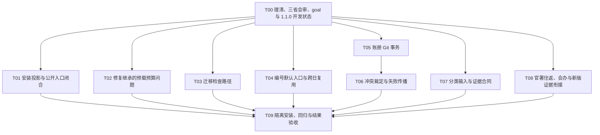

# 诏令矩阵 beta1.1.0 架构对齐与健壮性 Implementation Plan

> **For agentic workers:** 用户已批准以 super 并行和 `/goal` 推进新版本 1.1.0。
> 主线程 `gpt-6-astra / ultra`，全部子官署与工作子实例 `gpt-5.6-terra / ultra`。
> 先理清交接、基线和依赖，再建立原生 goal，按互斥写集并行执行本计划。

**Goal:** 在新版本 1.1.0（项目版本标识 `beta1.1.0`）保留合理演进，修复已确认的安装、编号、记忆裁定、事务与分类边界问题，
使当前项目框架对应的行为能够被安装后验证和结果证据确认。

**Architecture:** 太子受旨；中书、门下、尚书都履职并按依赖协作；尚书选择必要六部；
执行后形成系统级结果，经门下复核和授权归档后结诏。总流程、官署组织、运行载体
分开表达；MCP、三省细化、分类状态和内部结果映射在大方向不变时以新版为准。

**Tech Stack:** 现有 Python、PowerShell、Git、JSON、CLI／stdio MCP 和文件事务工具；
不增加服务、数据库、第三方运行依赖或第二套编号、状态机、账册权威。

**Spec:** [已批准项目框架及关联补充](../wiki/Architecture.md)、
[复核报告](../reports/2026-09-05-beta108-beta109-review.md)、
[实际隔离安装报告](../reports/2026-09-05-beta108-beta109-isolated-install.md)。

**Review status:** 用户已回复“准”，批准架构、整改清单、计划／任务书和 handoff；
并明确实施落在新版本 1.1.0，新会话理清后以 super 并行与 `/goal` 连续推进。
整改点总表见[整改清单](2026-09-05-beta1.1.0-remediation-register.md)。

## 授权与基线

- 当前授权覆盖本计划的本地代码／文档修复、必要测试、版本准备、隔离安装和 goal
  连续推进，不需要再次询问是否开始 T01。真实活动安装、宿主配置和外部发布仍不在范围内。
- 产品仓：`decretum-matrix`；交出时分支为 `release/beta1.0.9`，源码基线
  `0003b3800cd245abf870a82ff464a802cc0faeaf`。
- 实施目标是新版本 `beta1.1.0`，按仓库既有命名准备 `release/beta1.1.0` 开发状态；
  接收者先核对已有分支／受管任务，通过现有 repo-control 路径规则安排所有权。
  不把修复继续提交到历史 1.0.9，不改动已有 1.0.8／1.0.9 发布标签。
- 1.0.8 对照为分支头 `37df40da5232f230cde578599c8030982188bbd7`；发布标签为
  `5214e44ba2019fdf4306351b80325b555f14a43f`，二者不得混称。
- 当前架构、报告与交接材料为未提交文档集；执行者先保留它们，再确认工作区／分支
  所有权。root 与 child 暂存区在交接门保持为空。
- 根控制仓 `workspace.yaml` 的当前检出仍是旧项目登记；本次产品位置由用户明确
  指定、已存在子仓和应用项目列表确认。需要新 worktree 时先经 repo-control 解决
  映射；不手工制造第二个相同分支 worktree，也不把子仓加入根 Git。

## 全局约束

1. 正式非轻量任务中书、门下、尚书都履职，按依赖协作和复议，不要求固定机械顺序。
2. 六部保留固定身份，由尚书按职责、依赖和证据价值选择必要官署。
3. 串行允许主线程显式代行，各署责任、回奏与证据分别记录；不声称物理独立派遣。
   三省保留草案送审、封驳、可行性反馈与复议；六部保留按任务确定的主办／协办关系。
   横向征询不等于差遣，不自动扩大对方写集或绕过直接上级。
4. 大方向不变时采用新版细节，包含 MCP 与三省细化；原始文档是设计来源，不恢复旧执行计划。
5. 入口、当前 dossier/profile 与紧凑 metadata 保持 20 KiB 上限；完整架构文档按需读取。
6. 旧合法谱系与 court_code 保留；分类仍采用新版 `classified/review + reason` 合同。
7. 只修有实证的问题，不重写大模块，不增加任意 MCP 写工具或强制旧枚举。
8. 验证使用隔离 home、配置、数据和临时 Git 仓库；真实私有史馆、活动安装与宿主配置不作为 fixture。
9. 不 push、tag、PR、发布 Wiki／npm、下载依赖或更新活动副本，除非后续用户明确授权。
10. 每项行为修复先有可失败的回归，再实现最小修复，执行对应检查和必要调用方验证。
11. 产品 serial 模式允许代行的合同继续保留；本次实施使用
    `authority=super, behavior=parallel, runtime=native`，不启动 superCC。
12. 根线程 `gpt-6-astra / ultra`；所有子官署、工坊子实例为
    `gpt-5.6-terra / ultra`。使用宿主支持的显式模型字段，新派遣 `fork_turns=none`；
    记录实际创建证据，不能仅凭提示词声称覆盖。确有宿主拒绝时如实报告，不默默降档或继承 Astra。
13. 按依赖与写集分配真实官署；正常树上限 16（含 root）、深度 4，并以实际容量为限。
    各 worker 有明确文件所有权，不回退他人改动；Git 索引／提交由单一协调者串行操作。

## 事实分类

| 类别 | 内容 | 处置 |
| --- | --- | --- |
| 确认阻塞 | 两版实际安装入口因 repository-only overlap 拒绝 | T01 优先修复并重新隔离安装 |
| 确认回归 | 1.0.9 官署预载超限；迁移后的检查路径错误 | T02、T03 |
| 确认用户行为缺陷 | 编号默认索引／跨日、冲突误判／未来记录、账册事务与错误传播 | T04–T06 |
| 分类边界 | 路径污染；混合断言的词级正负集合合同 | T07，保留新版分类方法 |
| 合理演进 | MCP 12 工具、三省细化、二值分类状态、可选 RRF、按需能力检索 | 保留，不作为回退项 |
| 架构补充与待衔接裁定 | 三省往返、六部会办；中间状态与履职；结果模块与 runtime 的不同枚举 | T08 对照新版消息／证据链，不将同级协作改成越级差遣 |

## 阶段与依赖

以上为依赖图，不是强制串行队列；尚书可并行分配互不冲突的任务，同文件和 manifest
重生成先明确唯一 writer。T08 与其他任务重叠时先只读裁定再协调写入。
每项文件范围、接口与 RED/GREEN 步骤见[任务书](2026-09-05-beta1.1.0-robustness-task-book.md)。

## 验收出口

- 实际安装器使用未改写的最终 manifest 接受 plan/apply，产生安装 receipt 与可运行副本。
- 两个隔离安装目标的版本、CLI、MCP、公开依赖闭包和官署预载通过；失败恢复保留证据。
- 编号默认入口读取权威索引，跨日结诏复用原 session 分配，已有编号不被重写。
- 不同但可并存的事实不被确定性替代；未来记录不替代当前有效记录。
- 账册写入不夹带无关暂存内容；失败后文件和索引一致；顶层如实返回失败或部分结果。
- 分类不被路径指针强行命中；混合断言保留冲突证据并转待审；历史谱系兼容。
- 三省及六部实际履职／显式代行的证据可区分，内部状态与结果映射不造成虚报完成。
- 复核确认的失败项消除，既有相关通过项不退化；不可执行的宿主验证有具体原因，不能写成通过。

## 停止与回退

若发现目标超出隔离根、涉及真实凭据／私有正文、分支被其他 writer 占用、索引存在
未知暂存内容、需要外部发布或未知高风险状态变更，停止对应任务并报告精确阻塞。
不为了全绿删除负例、放宽预算、改写历史编号或补造 receipt。

本地代码提交须在实施获得授权后按任务形成；检查索引只含本任务允许文件，提交后
回读 HEAD 与空索引。未获提交授权时保留未暂存 diff，并记录精确修改集。

## 新会话交接

handoff 已获用户批准，使用 `create_thread` 创建本地全新会话，主线程设置
`gpt-6-astra / ultra`；禁止 fork 或以分支会话代替。新会话创建与产品 Git 新版本分支是两件事。
接收者先阅读[交接书](../handoffs/2026-09-05-beta1.1.0-framework-review-handoff.md)，
核实基线和用户裁定，回复字面量 `HANDOFF_ACCEPTED`；理清后调用原生 `create_goal`
建立 1.1.0 实施目标，不设置用户未指定的 token budget，然后继续执行。不能只回复
接收后结束，也不再次等待已经给出的启动授权。

交出游标：`USER_APPROVED / TARGET_BETA1.1.0 / SUPER_PARALLEL_NATIVE / ASTRA_ULTRA_ROOT / TERRA_ULTRA_OFFICES / T00_CLARIFY_THEN_GOAL`。
