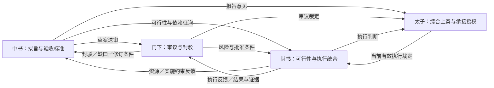
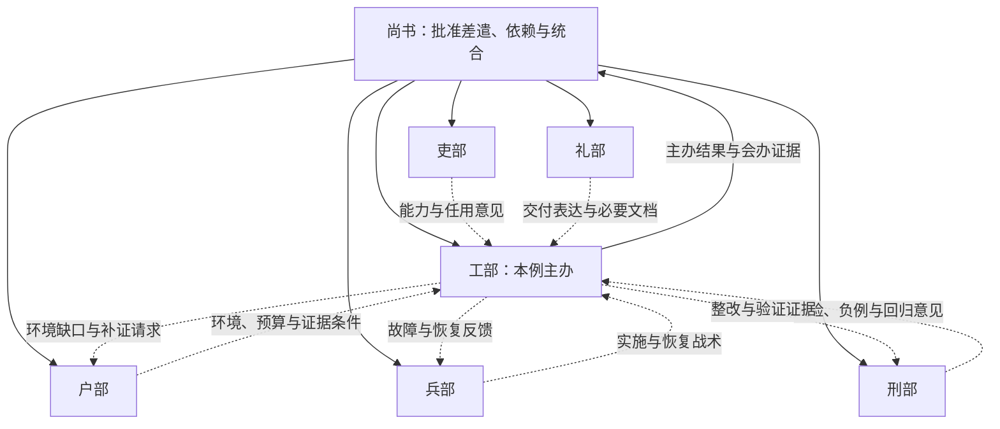
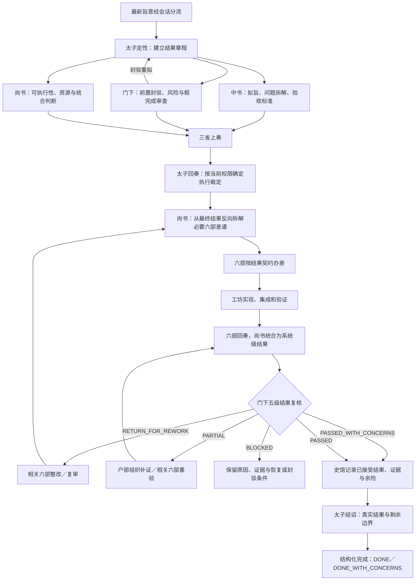

# Architecture

## 项目架构基准

诏令矩阵以“结果导向的三省六部流程”作为默认项目框架。2026-09-05 根据用户
明确指示，将 2026-07-12 原始流程、差异分析和整体整改方案采纳为后续设计、
实现与验收的架构基准；本文是该框架的维护入口。

采用原则：核心方向沿用原始架构，合理演进以新版本为准，包含 MCP、谱系分类、
三省职责细化、公共 API、状态表达与加载方式。原始命令、字段、枚举和模块耦合不
机械恢复；先判断差异是否损害职责、授权、真实结果或证据，再决定整改。

用户已确认的运行裁定：正式非轻量任务由中书、门下、尚书都履职，按依赖协作与
复议，不要求固定机械顺序；六部保留各自身份，由尚书按职责、依赖和证据价值选择
必要官署；串行允许同一主线程显式代行，但必须分别记录各署责任、回奏与证据。

框架保留太子、平级三省、尚书统辖六部、工坊执行、门下复核和史馆记录的责任链，
贯穿以下裁定优先级：

> 最终可用结果 > 功能闭环且不退化 > 风险边界 > 可验证证据 > 文档与单项任务完成

这里的优先级表示低层材料不能替代高层事实。风险和权限边界从受旨到结诏始终有效，
不允许先越界实现、最后再补风险审查。

本文定义项目应当达到的行为。某版本的代码、测试、宿主执行和发布结果分别以
对应证据确认；状态名相同或文档已经写入，不能证明完整架构已经实现。
最新用户旨意和当前授权继续优先，运行语义仍通过 `SKILL.md`、直接 governing
references 与既有 runtime 合同承载。发现实现差异时，应记录缺口并按授权修正，
不能用现有代码的限制反向删减核心验收要求；不影响大方向的细节按新版合同维护。

原始 Markdown 快照保存在产品仓的 `docs/architecture/sources/2026-07-12/`；
来源说明与版本差异索引在 `docs/architecture/README.md`。历史文档保留原来的
“现状图／目标设计／尚未实施”标注，作为设计来源，不作为当前执行命令或发布证明。

## 默认职责与上下级

```mermaid
flowchart TB
    U["用户：最新旨意与授权"] --> T["太子：受旨、转奏、综合回奏"]
    T --> Z["中书省"]
    T --> M["门下省"]
    T --> S["尚书省"]
    S --> HR["吏部"]
    S --> HU["户部"]
    S --> LI["礼部"]
    S --> BI["兵部"]
    S --> XI["刑部"]
    S --> GO["工部"]
    HR --> W["工坊／工匠：有界能力执行"]
    HU --> W
    LI --> W
    BI --> W
    XI --> W
    GO --> W
    Z -.-> H["史馆：三省共监、门下主审"]
    M -.-> H
    S -.-> H
```



图中实线表示差遣层级，虚线表示史馆监督关系。六部向尚书回奏，三省向太子回奏，
太子面向用户转奏与综合；史馆是记录机构，不是第七部。

“三省会审”“六部办差”只是总流程中的大步骤，不是合并官署或单个代理。
实际运行必须展开到中书、门下、尚书及被选中的六部，保持身份、职责、任务、协作、
回奏与证据。三省不是互不往来的阶段模块：中书可因封驳与执行反馈反复拟旨，门下
参与前审、必要的执行中裁定和终审，尚书贯穿可行性会审、差遣、依赖处理和结果统合。

框架区分三个层面：总流程表示阶段；官署组织表示谁承担责任、向谁差遣和回奏；
运行载体表示实际 agent／实例、工具动作与证据。并行由宿主真实官署 agent 按层级
履职，具体实例数量与复用遵循新版调度合同。串行可显式代行，不能把主线程已经
完成的统一结果事后改名为多个官署的实际独立回奏。

| 主体 | 框架职责 | 必要输出与边界 |
| --- | --- | --- |
| 太子 | 会话分流、意图初判、按需历史线索初判、建立结果章程、转奏与最终回奏 | 说明用户最终获得什么；不代替三省、六部或史馆履职 |
| 中书省 | 拟旨、问题拆解、考据、结果定义与验收标准 | 将结果章程写成可执行且可验收的方案；不直接指挥六部 |
| 门下省 | 前置封驳、范围与风险审查、假完成审查、最终五级复核 | 给出裁定、理由、证据和返工条件；不直接指挥六部 |
| 尚书省 | 可执行性、依赖与资源判断；批准后反向拆解六部差遣；统合结果 | 每份差遣绑定结果贡献，统合为系统级结果后送门下复核 |
| 吏部 | 能力发现、官籍、铨选与责任主体适任 | 有依据的能力选择；能力已登记或 agent 已启动不等于结果成立 |
| 户部 | 环境、依赖、预算、路径、证据覆盖与可复现条件 | 资源与补证结论；计数或账本完整不替代直接证据 |
| 礼部 | 用户契约、验收表达、必要文档与报告体例 | 区分普通文牍与安全、交付所必需的文档 |
| 兵部 | 实施、并行、集成、故障恢复与重试战术 | 办差与恢复路径；队列清空不等于功能闭环 |
| 刑部 | 风险、负面场景、不退化与回归审查 | 封驳条件、风险边界和复审证据 |
| 工部 | 实际营造、集成、运行验证与交付 | 可用产物、目标状态和端到端证据 |
| 工坊／工匠 | 在六部差遣内使用 skill、MCP、CLI、script 或 agent | 明确输入、写集、结果、证据与停止条件 |
| 史馆 | 记录裁定、结果、证据、余险、回退过程和允许的记忆决定 | 记录已有事实；归档或召回不产生执行权与完成事实 |

“拆解”分属不同阶段：中书拆解问题并拟旨，尚书拆解已批准结果所需的执行差遣。
太子建立结果章程，不替两者完成各自职责。三省平级，不把图中的排列顺序解释为
中书、门下、尚书之间新增上下级。

## 三省协作与六部会办

### 历史参考与项目映射

参考隋唐三省的职掌与政务文书流转：拟定、审议和奉行相互衔接，各省有职责且共同
处理政务。历史研究也强调三省之间程序化的联系与依存关系，而不只是分列三个
官名。[中国法学网《唐代政治制度的历史特点》](https://iolaw.cssn.cn/gdfls/200506/t20050616_4596248.shtml)

唐前期的政务通过文书上下传递，尚书六部承担分类统摄与执行组织，各层级具有不同
处理职责。这为项目区分“正式差遣”“会办沟通”“回奏复核”提供参考。
[《律令制与唐前期国家治理体系的基本特征》](https://www.sunyat-sen.org/portal/article/index.html?cid=78&id=54288)

下述软件协作关系是项目设计映射，不是对古代具体六部往来、现代工具职责或所有
朝代制度的原样复刻。项目“太子”是用户侧协调角色，不能据此声称历史太子统辖三省。

### 三省的往返关系



这些箭头表示材料与意见流转，不表示三省之间互为上级。三省会审可按依赖穿插和
反复进行：中书向尚书询问执行约束，门下向两省提出风险与补证要求，尚书将实际
执行问题反馈中书修订和门下复核。涉及章程、权限或验收变化时回到三省与太子的
裁定路径；范围内的实施细节由尚书组织处理，不让每次沟通都重新触发整套会审。

### 六部的依赖与会办关系

六部之间可以在尚书已批准的差遣内交换材料、征询专责意见、协调接口与补证。
每个子任务有主办责任和相关协办责任；主办部不因主办地位成为其他部的直属上级。
主办、协办及依赖关系由当前任务决定，不设固定的六部线性流水线。

下图为“实施类任务由工部主办”的会办示例；其他任务可由礼部、兵部等主办，
只实际调用必要官署，不要求每次六部全部出场。



实线是尚书的差遣／回奏关系，虚线是六部会办。各协办部的结论保留署名并向尚书
回奏；主办部不能代改其审查结论。跨部依赖、优先级、资源或写集冲突交尚书协调；
风险裁定交门下，章程变更交中书重拟并经相应裁定。

### 关系类别与权限边界

| 关系 | 可做什么 | 不产生什么 |
| --- | --- | --- |
| 正式差遣 | 上级在当前授权下分派任务、写集与验收 | 不绕过 direct_superior、准入或宿主能力 |
| 草案送审／封驳 | 传递方案、风险、修改条件与裁定依据 | 不使审查方成为执行部的上级 |
| 横向会办／征询 | 请求材料、接口约定、证据或职责内意见 | 不擅自为对方新增任务、改优先级或扩大写集 |
| 执行反馈／复议 | 说明阻塞、回归、资源与实际结果，触发必要重拟 | 不自行覆盖有效章程或已确认验收 |
| 回奏／统合 | 各署提交结论，尚书整合、太子综合呈现 | 不把汇总文本当成原署已验证证据 |

横向会办默认只在同一有效任务、已批准 scope／write_set 和被选中官署之间进行。
需要未出场官署新增工作时，由其上级正式差遣；不能用“咨询消息”规避准入。
宿主不支持直接同级通信时，可由尚书或太子转递，保留发起方、接收方与原结论。
串行时在主线程内显式记录同样的材料往返与分署结论，不伪造物理消息投递。

每次有意义的往返至少能回指当前 task／章程版本、发起署、接收署、目的、输入材料、
返回结论与证据；实现优先复用现有 message／event／bounded trace，不新建会办账本。
同级会办与同级差遣必须可区分：后者仍按现有层级拒绝；不把横向关系加入 dispatch
允许边来绕过尚书统辖。只有产生新问题、证据或明确修改要求才继续复议，避免空转。

## 会话入口与结果章程

太子结合最新消息和当前会话状态进行语义判断，`conversation_gate` 校验结构化
裁定是否一致。实现不应退化成仅凭关键词猜测用户意图的分类器。

| 消息类别 | 框架路由 |
| --- | --- |
| `CASUAL_CHAT` | 自然回应；不创建正式任务，不改变在办任务 |
| `TRIVIAL_DIRECT` | 无工具、无状态变更、无风险的轻量直答 |
| `TASK_CANDIDATE / AMBIGUOUS` | 三省限域审议待决事项，太子只问一个最高影响问题，答复后重新分类 |
| `UNCLEAR_RELATION` | 确认补充当前任务还是独立任务，避免混合两个边界 |
| `FORMAL_TASK` | 建立结果章程，进入正式三省会审 |
| `TASK_CONTINUATION` | 沿当前有效章程继续，按需要复议 |
| `TASK_CORRECTION` | 停止按失效章程继续执行，修订章程并返回三省复议 |
| `SIDE_CHAT` | 回应旁支交流，保持在办任务状态 |

`ConversationGate` 是创建正式任务前的逻辑门，不要求新增同名持久化状态。
可通过上下文或低成本只读检查确定的事实，应先自行核实；已明确授权的事项不重复
追问。用户明确要求会话结诏时，只汇总该会话尚未结诏且与请求相关的内容。

结果章程至少说明：任务类型、最终可用结果、用户使用场景、功能闭环、不退化要求、
风险边界、非目标、验收标准、结果证据要求、允许动作与写集、停止条件及史馆策略。
实现任务验收可用能力，运维任务验收目标状态，审查任务验收可指导决策的发现，
方案任务验收可实施方案；不能给所有任务套用同一种“文件已修改”的完成标准。

## 正式主流程



先完成三省各自审议，再由太子回奏承接执行裁定。需要再次授权时才向用户请求；
已有授权不能被机械增加的流程问答覆盖。尚书只分派有职责、依赖或证据价值的六部
子集，不为填满六部或并发容量而派遣。无需六部专责的简单任务可由尚书办理，
但须记录理由，不能作为默认跳过六部的路径。

每份六部差遣必须绑定：结果贡献、真实交付物或目标状态、验收标准、结果证据、
依赖与写集、回归及风险、失败回退责任和停止条件。六部全部关闭任务，仅表示
分项工作结束；尚书仍须检查集成、依赖和冲突，形成系统级结果。

`authority=approval|autonomous|super` 决定允许做什么；
`behavior=serial|parallel` 决定如何组织执行。串行保留各官署责任与
`serial_inline` 记录，禁止以串行为由让太子冒充各署成果。物理并行时仍按
太子→三省、尚书→六部、六部→工坊的直接上级关系投递。

`court semantic checkpoint/verify` 的 `VERIFIED/DISPATCHABLE` 是 P00 语义门禁；
`agent-admit` 是投递或 mutation 前的最终准入检查。它们各自只证明所检查的机器
事实，不等于官署已派遣、已回奏或已形成结果。官署履职须绑定真实宿主
spawn/reuse/wake 与回奏，或有责任主体、任务和原因的 `serial_inline`；缺失时
如实记录 `runtime_degraded/PARTIAL`，不以状态推进替代履职。

## 门下五级复核与失败回退

“五级”是五层检查，不是五个状态名：

| 层级 | 必须回答的问题 | 失败后的责任与路径 |
| --- | --- | --- |
| 1. 最终可用结果 | 产物或目标状态是否真实存在，用户能用它做什么？ | 尚书重新统合，工部重新营造；不得完成 |
| 2. 闭环与不退化 | 端到端场景是否成立，关键既有能力是否保持？ | 兵部／工部重办，刑部复审 |
| 3. 风险边界 | 权限、数据、成本、破坏性与余险是否可接受？ | 门下封驳，刑部提出条件，尚书重排；需要外部条件时受阻 |
| 4. 可验证证据 | 证据是否直接、可信、新鲜且绑定当前章程？ | 户部组织补证，相关六部重验；保留 `PARTIAL/NOT_VERIFIED` |
| 5. 文牍与单项任务 | 普通文档、分项任务与奏报是否一致？ | 礼部补齐；非阻断缺口可带保留通过 |

安全使用、部署或交付所必需的文档属于闭环或风险要求，不能按普通文牍缺口放行。
章程本身错误时返回三省重拟；证据不足时保留恢复入口；风险已封驳时保留拒绝依据。

原始五类裁定的行为语义应可表达；新版可通过分层结果与适配承载，不要求每个
内部接口都使用旧枚举。必须验证映射没有丢失余险、返工责任或完成边界：

| 裁定 | 框架要求 |
| --- | --- |
| `PASSED` | 允许记录已接受结果，再完成结诏 |
| `PASSED_WITH_CONCERNS` | 允许记录结果与余险，最终用户状态为 `DONE_WITH_CONCERNS` |
| `RETURN_FOR_REWORK` | 返回尚书／相关六部，或因章程问题返回三省；旧验收失效 |
| `PARTIAL` | 不得映射为完成；保留证据、补证责任和恢复入口 |
| `BLOCKED` | 不得映射为完成；记录阻断条件，可恢复则暂停，已封驳则拒绝 |

`PARTIAL/BLOCKED` 可用现有状态加结构化裁定表示，不要求为每个图节点建立新的
顶层状态。`DONE_WITH_CONCERNS` 是最终结果表达，具体存储方式应复用既有完成合同。

## 证据、状态与结诏

`result_plane` 证据直接证明可用结果、端到端行为、不退化或目标状态；
`control_plane` 证据证明队列、gate、计数、文档和记录等过程事实。
后者可以支持前者，不能单独满足完成条件。文档或审查本身就是交付物的任务，
仍须按对应任务类型证明该交付物可用。

保留既有正式主状态链：

```text
Pending → Taizi → ThreeDepartments → ThreeDepartmentsPetition → TaiziReply
→ ShangshuDispatch → SixMinistries → Workshops → MenxiaReview
→ ShiguanRecorded → Done
```

尚书统合、五级检查与官署回奏应由结构化证据承载，不因图中出现这些节点就新建
第二套状态机。任务状态只能投影已有事实；不能从“已经进入 MenxiaReview”推断
门下已实际复核，也不能从 `DISPATCHABLE` 推断三省已完成上奏。

完成责任顺序为：门下形成当前有效的结果裁定 → 史馆在授权范围记录结果与证据
→ 太子通过结构化完成路径结诏。完成时重新验证当前章程 revision、证据绑定、
门下裁定和史馆 receipt；禁止自由文本 `evidence` 或单独 checkpoint 直接完成。
修订章程、返工或恢复后，应使旧验收与旧完成证明失效并按现有恢复合同重新核验。

记录权与执行权继续分离。用户禁止写入时，报告真实结果与归档边界，不编造
诏令编号、谱系或归档成功。史馆 GBrain、索引、Git 与 Obsidian 投影不覆盖最新旨意。

## 架构验收基准

后续修改应根据受影响环节选择行为级验收，至少保持这些关键反例：

- 闲聊、旁支交流和未确认任务候选不会错误创建、取消或完成正式任务。
- 修改范围、权限或验收标准后，失效章程不能继续投递或用于完成。
- 三省、六部各自履职可追溯；语义门禁、准入和状态变更不能冒充回奏。
- 太子或中书／门下不能越级直接派遣六部；串行仍保留责任链。
- 六部分项完成但系统级结果缺失，或者只有控制面证据时，不能完成。
- 门下裁定经新版结果合同或明确映射，贯通评估、运行时绑定、返工／补证、归档
  与最终表达；不以统一旧枚举代替行为级验收。
- 当前证据、章程或 receipt 不匹配时拒绝完成；完成失败后状态与事件可一致恢复。
- 普通文牍缺口可带保留通过，安全／交付必需资料缺失仍阻断。

这些是验收要求，不是当前版本全绿声明。`beta1.0.9` 的已观察差异记录在产品仓
`docs/architecture/implementation-status-beta1.0.9.md`，按其中绑定的源码提交解读。

## 五层架构

```text
通用任务治理框架
├── 史馆 GBrain
├── 治理实现
│   ├── three-departments-six-ministries（默认官方实现）
│   └── direct-review（非默认参考实现）
├── 能力与运行适配层
└── 呈现层
```

### 通用任务治理框架

框架承担任务接收、边界确认、生命周期、能力协调、证据管理、验收、暂停、
恢复和回放。现有 court runtime、semantic receipt、operation journal 与 release /
install gates 仍是唯一状态和执行权威；治理注册表不写任务状态，也不创建第二
ledger、第二语义胶囊或第二状态机。

`references/manifests/governance-implementations.v1.json` 只选择治理语义。默认
实现固定为 `three-departments-six-ministries`。每个实现必须复用框架服务：
state/evidence 为 `court-runtime`，memory 为 `shiguan-gbrain`。

事实、解释、裁定、行动、验证、记忆与呈现使用
`decretum.semantic.record.v1` 建立可验证关系。它是纯验证合同，不是新存储：
事实不能由解释冒充，行动必须有裁定依据，验证必须绑定事实与行动，记忆和呈现
不得取得执行权。

新正式任务通过 `court.request_understanding.v1` 评估目标、使用场景、关键要求和
验收标准。低于 95 只进入单问题澄清；达到阈值后复述确认，或在旨意已经明确时
直接执行。`RESTATE_CONFIRM` 仅是待用户确认的前置态，不能创建正式任务；确认后
才转为 `DIRECT_EXECUTION`。该对象嵌入 conversation gate，不形成第二任务状态。

### 史馆 GBrain

史馆 GBrain 复用 shared Shiguan index、实录和既有 memory decision 工具，提供
经历实录、长期记忆、情境召回、冲突保留、时效判断与再裁定。召回 envelope 为
`decretum.gbrain.recall.v1`，固定 `authority=advisory`、
`execution_authority=false`、`current_decree_precedence=true`。因此不同治理实现
可以共用相同召回结果，但历史记忆不能覆盖最新用户旨意。

共享 `references` 根同时承载一个 local-only Git 管理 hub。它用稳定 registry、
工具 namespace、双向 managed link 和 paired receipt 连接 Codex、Claude Code、
Hermes 各自的原生记忆仓库；跨仓库提交不伪装成原子事务。GBrain 只读取裁剪后的
store/commit/transaction provenance，不暴露本机 native root 或 git-dir。
空白机的 probe 不写入；显式 apply 才创建 Codex、Claude Code、Hermes 的 canonical
memory root 与 entrypoint，并将三者全部登记到史馆。

### 治理实现

三省六部完整保留太子、三省、六部、工坊、会审、回奏、差遣、复核和古制表达。
官方适配器直接读取既有 `court-dispatch-hierarchy.v1.json`，不复制层级边。

`direct-review` 只证明有限替换性：coordinator 负责接收、解释、协调和呈现，
reviewer 负责裁定和验证，executor 负责行动。它不是默认实现，不启用动态代码、
远程发现、插件市场或新的运行服务。

### 能力与运行适配层

Codex、Hermes、CLI、superCC、skills、MCP 和 scripts 将有界差遣映射到当前宿主
能力，并回传既有结构化结果。适配器不能改变直接上级、权限、写集、安全门、
pending body 边界或治理实现的角色职责。

执行路由固定为三个相互独立的结构化维度：`authority` 只能是
`approval（审批/默认只读）|autonomous（自主/范围内实施）|super（超级执行/范围内连续推进）`，
`behavior` 只能是 `serial（串行）|parallel（并行）`，`runtime`
只能由启动入口确定为 `native|superCC`。`super parallel` 仅表示
`authority=super, behavior=parallel, runtime=native`，不得探测或选择 superCC。
superCC 只能从自己的 zellij+squad 入口启动；同一 task/process 不得在 native 与
superCC 之间共存、切换或回退。native 使用 `court.native.task` 状态命名空间和
ordinary office dossiers，superCC 使用 `court.supercc.task` 状态命名空间和
superCC dossiers。二者只共享中性的层级/standing-profile 配置 pointer/hash，
不共享 task state、transport、admission 或 lifecycle。

需要选取具体能力时，读取并缓存当前 capability index，形成包含 skill、MCP、
plugin、CLI 和 script 建议分配的结构化 snapshot，再按职责提供 pointer/hash。
闲聊、直答或无需能力检索的规划不运行 registry。吏部维护 registry，读取
snapshot 本身不要求额外派遣吏部官署；缺失、陈旧或损坏的 index 按当前授权触发
一次有界维护差遣，不创建第二 registry、daemon 或 umbrella CLI。
`court open --fast` 承担规划后的 machine preflight，不替代太子受旨、三省会审
或真实宿主投递。官署入口、dossier/profile 和紧凑 metadata 合计保持 20 KiB 上限；
完整架构文档按需阅读，不并入每个官署的固定预载。

### 呈现层

CLI、用户侧结诏、史馆 Web 与 Obsidian 只呈现已绑定的事实、裁定和证据。
呈现文本不是任务状态、执行授权或记忆权威，派生视图不得反向覆盖源记录。

## 仓库与数据边界

```text
D:\project                         root control plane
decretum-matrix child repository   product source and releases
~\.agents\court-shiguan\...        shared local evidence/data
```

root 管 worktree/task 映射；child 管 skill、profiles、dossiers、scripts、package 与
release；shared Shiguan 管本机 records、indexes、memory decisions 与投影。三者不
双写成同一个 ledger。

Codex、Claude 与 Hermes 的 native memory 继续归各自 loader/store 管理。共享
史馆只保存 metadata、裁定、registry 和引用，不复制原生私有正文或 native Git
objects。共享仓库无 remote，native 仓库独立存在；不使用 submodule/subtree。

现有实现复用文件锁、原子替换、目录 fsync、generation/digest CAS、operation
marker、preimage、receipt、reconcile 与 rollback，不依赖新的 service、DB、MQ
或全局事件账本。
